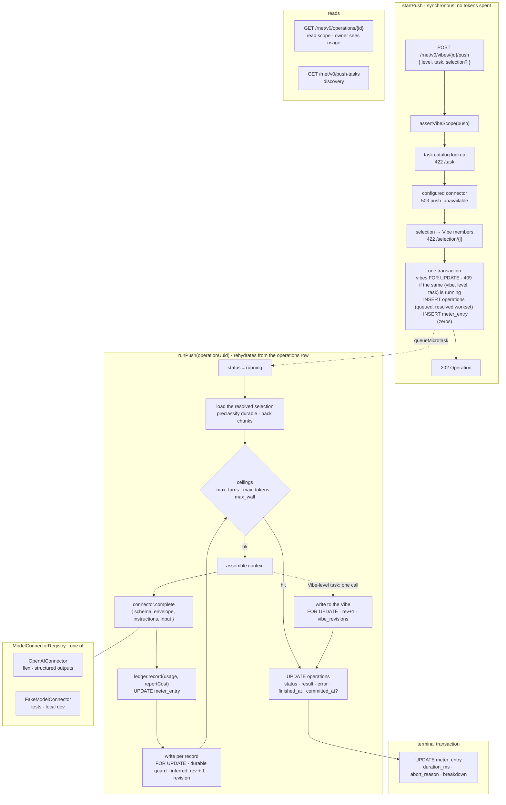

# Push pipeline

**Status:** Draft M3 implementation plan for review. No implementation is included in this document.

**Companion docs:** [implementation plan](../IMPLEMENTATION_PLAN.md) §3 (Inference, Agent harness), §5.1, §8 M3; [conformance status](../CONFORMANCE.md); rNet spec §2.3, §2.4, §3.2, §4.3, §6.2.

**Base:** `main` at `07f9434`. Branch `m3/01-push-pipeline`, one PR to `main`.

## 1. Purpose

Make `POST /rnet/v0/vibes/{id}/push` a real asynchronous operation: accept, return an `Operation` handle, run a store-defined task through a swappable `ModelConnector` (first connector OpenAI, `gpt-5.6-luna`, flex tier), land results under `rhizome:{task}` in element-, object-, and Vibe-level `inferred` blocks without ever replacing a `durable: true` entry, and persist one `meter_entry` row per run so cost is queryable.

M3 ships five tasks (§5.3): `summarize` and `vibe_view` at the Vibe level; `display_name` and `search_keywords` at the object level; `describe_media` at the element level. Tasks see the **observed shape** of objects; `type` is a hint that prompts and rules may use, never a gate that keeps an object out of a task, because many Vibes will hold dMachine-defined, often polymorphic object types the store has never heard of.

Adding a task means adding a directory under `apps/server/src/push/tasks/{level}/` (manifest, prompt, output schema, optional rules), one line in `installed-tasks.ts`, and regenerating the host's task list (§10); no server module outside `tasks/` and `installed-tasks.ts` knows a task name, and the host is a typed consumer of the generated list (§10) that names the tasks it renders. The five M3 tasks between them cover every variation the manifest allows: element-, object-, and Vibe-level; text-only and image input; model-only (every dispatched chunk is a provider call) and rules-first (a deterministic `rules` function sees the `VibeContext`, decides clear-cut cases, and the model is called only when it returns nothing).

### Exit test (plan §8 M3, as assertions the suite proves)

| Criterion               | Proof                                                                                                                                                                                                                                                              |
| ----------------------- | ------------------------------------------------------------------------------------------------------------------------------------------------------------------------------------------------------------------------------------------------------------------ |
| inferred blocks present | after each object or element task, every applicable record has `inferred["rhizome:{task}"]` with a valid envelope; after each Vibe task, `vibes.inferred["rhizome:{task}"]` exists and the Vibe validates against `vibe.json`                                      |
| costs queryable         | `SELECT payer, model, tokens_in, tokens_out, usd FROM meter_entry m JOIN operations o ON o.uuid = m.operation_uuid` returns one row per push with `usd` matching the rate-card arithmetic                                                                          |
| connector swappable     | the integration and black-box suites run on `FakeModelConnector` injected through `AppDependencies`; the OpenAI connector is exercised only by stub-fetch unit tests; a grep test proves nothing outside `inference/openai/` imports provider code                 |
| per-run cost visible    | every run the process finalized (done, failed, aborted) leaves a closed `meter_entry` row and the owner sees `result.usage` on `GET /operations/{id}`; a boot-swept run keeps the usage recorded before the restart, with `duration_ms` null and no `result.usage` |
| CONFORMANCE M3          | a seeded `durable: true` entry at the same key survives a push byte-identical; entries under every other key survive untouched                                                                                                                                     |
| keyless CI              | `bun run check` and `bun run test:e2e` pass with no `OPENAI_API_KEY`                                                                                                                                                                                               |

## 2. What the review found

A five-lens audit of plan, spec, schemas, and code produced 19 verified findings. The adversarial pass reframed all of them as implementation constraints rather than contradictions between authoritative sources.

The constraints that shape the design (each maps to a section below):

| Finding                                                                                                                                                         | Resolution                                                                                              |
| --------------------------------------------------------------------------------------------------------------------------------------------------------------- | ------------------------------------------------------------------------------------------------------- |
| No write path can land `rhizome:{task}`, cite the operation, or enforce the durable rule for user-invoked task output (`media-object-service.ts` `setInferred`) | Internal store writer, §7                                                                               |
| Polling a push needs `read`; starting it needs only `push`; the serializer redacts only pull results (`operation-service.ts`, `operation-serializer.ts`)        | `read` to poll, `push` to start; the serializer omits `usage` from push results for non-owners, §6.5    |
| `meter_entry.payer` is NOT NULL and no payer policy exists yet                                                                                                  | The store pays for everything in the alpha: `payer = 'rhizome'`, attribution through `invoked_by`, §8.1 |
| No Vibe-level inferred write path anywhere                                                                                                                      | `writeVibeTaskInferred`, §7.4                                                                           |
| Batch tier needs a poller the in-process lifecycle cannot host before M7                                                                                        | Flex only, §4.3                                                                                         |
| OpenAI strict mode accepts a JSON Schema subset                                                                                                                 | Authoring rules asserted at load, §5.5                                                                  |
| Rate-card numbers in the plan are already stale for Sol                                                                                                         | Rate card with provenance lives in the connector, §4.3                                                  |
| No provider config surface; CI has no key; generator builds the app with a stub config outside tsc                                                              | Optional config, injectable registry, 503 when absent, §4.5–4.6                                         |
| Three model-identifier spellings                                                                                                                                | `model:{provider}/{name}` in config, `{provider}/{name}` stored, §4.2                                   |
| One `meter_entry` row per operation while object tasks make N calls                                                                                             | Ledger accumulates, `breakdown.calls` per call, §8.2                                                    |
| Plan says context reads `users.inferred`; nothing writes it                                                                                                     | Not read in M3, deferred with a leak-policy question, §12                                               |
| Host `useOperation` refreshes only the Vibe queries on `committed_at`                                                                                           | Push sets `committed_at` and the host invalidates the records the result names, §6.4, §10               |
| Playwright lane is a mocked store with no DB                                                                                                                    | Exit criteria proven in `bun test`; e2e is a regression gate plus the host panel's mock, §11            |
| `rhizome` writer name is only protected by dMachine-name uniqueness                                                                                             | `STORE_WRITER` constant in store-contract; reservation is M6/M7 registration work                       |

## 3. Architecture



The accept path is cheap and spends nothing; a run is a loop of assemble, complete, record, write, with the ledger updated before every write so a crash loses a write, never a recorded charge. The run rehydrates its workset from the `operations` row alone and loads every record live (§6.4a).

The loop drawn is the object-level path (`display_name`, `search_keywords`). An element-level task (`describe_media`) runs the same loop over the image elements of the selected objects, deduplicated by element UUID, and writes per element (§7.3). A Vibe-level task (`summarize`, `vibe_view`) takes the dotted branch and shares everything up to and including the connector call and the ledger. It differs in four places:

- one call, never chunked, and no `selection` (it describes the whole Vibe): the `VibeContext` (§5.2) followed by each distinct member's per-object context, and oversize context truncates from the end rather than fanning out;
- a `rules` short-circuit, which only a Vibe-level task has, sees the whole `VibeContext` and can answer without a call (`vibe_view`);
- the write targets the `vibes` row (`rev + 1`, a `vibe_revisions` snapshot) instead of one transaction per object;
- the result carries a single `vibe.outcome` instead of per-object outcomes.

An element-level task reports per-element outcomes under `elements` (`written`, `preserved`, `skipped` with the same reasons) alongside the per-object `no_input` skips.

## 4. ModelConnector boundary

### 4.1 Layout

```
apps/server/src/inference/
  model-connector.ts            interface, ModelUsage, CostReport, ModelConnectorError, target grammar
  connector-registry.ts         ModelConnectorRegistry, createModelConnectorRegistry
  structured-output-schema.ts   assertStructuredOutputSchema(): the strict subset (§5.5)
  fake-connector.ts             FakeModelConnector (tests, local dev)
  openai/
    connector.ts                raw fetch to /v1/responses, retries, timeouts, parsing, usage mapping
    responses-api.ts            wire types for the request and the response subset we read
    rate-card.ts                nano-USD integers with source URL + verifiedAt; priceUsage()
```

No `openai` npm package: one endpoint, structured outputs, and a usage block are a few hundred lines with an injected `fetch`, and it keeps "swapping providers touches one file" literally true. `test/inference-boundary.test.ts` greps that nothing outside `inference/` imports `inference/openai/` and that `config.ts` imports only `inference/config.ts`. The registry lives in `inference/`, not `push/`: provider configuration, model naming, and usage normalization are provider wiring, not push logic.

### 4.2 Interface

```ts
// A model target as configured: "model:{provider}/{name}", e.g. "model:openai/gpt-5.6-luna".
// The provider is a lowercase slug; the name is whatever the provider calls its model.
export const MODEL_TARGET_PATTERN = "^model:[a-z][a-z0-9-]*/[A-Za-z0-9][A-Za-z0-9._-]{0,127}$";
export interface ModelTarget {
  provider: string;
  name: string;
}
export function parseModelTarget(target: string): ModelTarget;
export function modelIdentity(t: ModelTarget): string; // "openai/gpt-5.6-luna": meter_entry.model and inferred.model

export interface CompletionRequest {
  target: ModelTarget;
  instructions: string;
  input: string;
  schema: JSONSchema; // the batch envelope or output.json for this call, in the provider's strict-mode subset (§5.5)
  schemaName: string; // provider-facing label for the format, [A-Za-z0-9_-]{1,64}, e.g. rhizome_search_keywords
  effort: "low" | "medium" | "high";
  maxOutputTokens: number;
  timeoutMs: number;
  signal: AbortSignal;
  trace: { operationUuid: string; call: number };
}
export interface ModelUsage {
  tokensIn: number;
  cachedTokensIn: number;
  cacheWriteTokensIn: number;
  tokensOut: number;
  reasoningTokensOut: number;
  servedTier: "flex" | "standard"; // normalized (§4.3); what reportCost prices against
  servedTierRaw: string | null; // the provider's echo, kept for the breakdown
  tierAssumed: boolean; // the echo was missing or unrecognized
  providerModel: string | null;
  providerRequestId: string | null;
  durationMs: number;
  attempts: number;
}
export interface CompletionResult {
  output: unknown;
  usage: ModelUsage;
}
export type ModelConnectorErrorKind =
  | "auth"
  | "invalid_request"
  | "rate_limited"
  | "provider_unavailable"
  | "timeout"
  | "aborted"
  | "output_truncated"
  | "output_refused"
  | "output_invalid";
export class ModelConnectorError extends Error {
  kind: ModelConnectorErrorKind;
  retryable: boolean;
  status?: number;
  providerRequestId?: string;
  usage?: ModelUsage; // present whenever the provider produced a billable response
}
export interface CostReport {
  usd: string /* 6-dp decimal */;
  rateCard: { id; source; verifiedAt; tier; longContext };
}
export interface ModelConnector {
  provider: string;
  models: readonly string[];
  complete(r: CompletionRequest): Promise<CompletionResult>;
  countTokens(i: { target; instructions; input }): Promise<number>; // packing estimate only
  reportCost(usage: ModelUsage, target: ModelTarget): CostReport; // pure; throws on unknown model
}
```

Plan §3 also names `stream`; it is added in M5 with its first consumer (the harness and the SDK's `agent.stream`) rather than shipped now as a method nothing calls. `complete` hands `schema` to the provider's structured-output feature, parses, re-validates with a connector-private AJV, and throws `output_invalid` (with usage) on mismatch. It never returns unvalidated output and never returns a success without a usage block. Errors carry `usage` whenever the provider billed the call, which is what makes "every token metered" hold on refusal, truncation, and invalid output.

### 4.3 OpenAI connector

- `POST {baseUrl}/v1/responses` with `service_tier: "flex"`, `store: false`, `instructions` = PROMPT.md, `input` = one user turn of assembled context, `text.format = { type: "json_schema", name, strict: true, schema }`, `reasoning.effort`, `max_output_tokens`, `metadata.rhizome_operation`.
- Retries: ≤ 4 attempts on network errors, 408, 409, 429 (flex capacity shortfall is a 429 and is uncharged), 5xx; exponential backoff honoring `Retry-After`. `timeoutMs` (10 min; the flex guide recommends 15, and the operation wall ceiling bounds the run) is one deadline for the whole `complete` call, attempts and backoff included: a backoff sleep is capped by the remaining deadline and interrupted by the operation's signal, so a `Retry-After` past the deadline ends retrying with the last failure's kind. **Never** escalates to `service_tier: "default"`: that silently doubles the rate the plan budgeted.
- Mapping: every response or failure becomes exactly one result or error kind, per the table below; a row that reached a billed response carries its usage. There is no other exit, and a unit case covers every row.
- Usage: `input_tokens`, `input_tokens_details.cached_tokens`, `cache_write_tokens`, `output_tokens`, `output_tokens_details.reasoning_tokens`, the echoed `service_tier`, `x-request-id`.
- Tier: the echoed `service_tier` can differ from the requested one (verified), so usage is priced against it after normalization: `flex` → `flex`, `default` → `standard`; a missing echo is priced at the requested tier with `tierAssumed: true`; any other value is priced at `standard`, the higher known rate, with the raw string kept in `servedTierRaw` and `tierAssumed: true`. `ledger.record` persists tokens before it prices, and `reportCost` throws only on an unknown model, which boot prevents (§4.6).
- The OpenAI Batch API is a named non-goal: it needs persisted provider job ids and a restart-surviving poller, which is the durable-execution work CONFORMANCE defers to M7. Flex is priced at batch rates.
- Models: the connector serves `gpt-5.6-luna`, the model the plan budgets for push: it takes text and image input and supports structured outputs on the Responses API. `models` lists it alone; boot rejects a configured default target the connector does not serve (§4.6), so nothing is ever priced at zero.
- Rate card (`rate-card.ts`): nano-USD per token for `gpt-5.6-luna` at the flex and standard tiers, each with its long-context regime, with `id`, `source` URL, and `verifiedAt`. Re-verify on the pricing page before merge; `verifiedAt` in every breakdown row makes a stale card visible in the data.

| Response or failure                                                                                        | Result or kind                                               |
| ---------------------------------------------------------------------------------------------------------- | ------------------------------------------------------------ |
| network error, 409, or 5xx after the retries                                                               | `provider_unavailable`                                       |
| 408 after the retries                                                                                      | `timeout`                                                    |
| 429 after the retries                                                                                      | `rate_limited`                                               |
| 401, 403                                                                                                   | `auth`                                                       |
| 400, 422, and every other 4xx                                                                              | `invalid_request` (a rejected schema fails loudly, no retry) |
| a 2xx body that is not the Responses envelope                                                              | `provider_unavailable`                                       |
| `completed` with output text that parses and validates                                                     | the result, with usage                                       |
| `completed` with no output text, non-JSON output, or an AJV miss                                           | `output_invalid`, with usage                                 |
| a `refusal` content part                                                                                   | `output_refused`, with usage                                 |
| `incomplete` for `max_output_tokens`                                                                       | `output_truncated`, with usage                               |
| `incomplete` for `content_filter`                                                                          | `output_refused`, with usage                                 |
| `incomplete` for any other reason                                                                          | `output_invalid`, with usage                                 |
| `failed`                                                                                                   | `provider_unavailable`, with usage when the body carries it  |
| any other HTTP status, a final 3xx included                                                                | `provider_unavailable`                                       |
| `queued`, `in_progress`, or `cancelled` (M3 never sets `background`, so these are fail-closed, not polled) | `provider_unavailable`, with usage when the body carries it  |
| the connector's deadline (`timeoutMs`, across attempts and backoff) elapses                                | `timeout`                                                    |
| the operation's `AbortSignal` fires (the wall ceiling)                                                     | `aborted`                                                    |

### 4.4 Fake connector

`FakeModelConnector` generates a schema-conformant instance deterministically (enum → first value, `["T","null"]` → `T`, number → `0.5`, string → `"fake"` or, for a `pattern`, a fixed sample per pattern the M3 tasks use, `/source/properties/fake` for `RecordPointer`), and emits one envelope item per `ref` enum value, so batches round-trip unscripted for every task whose validity is schema-only. `vibe_view`'s model path also has the observed-pointer post-check (§5.3), which a generated pointer fails, so its tests script the response with an observed pointer. It accepts a `respond` override that may return a scripted result or a `ModelConnectorError` with usage to drive those paths, records every request and its attachments, and prices with the real Luna card so `usd > 0` in tests. It serves the default target, so tests configure nothing. Selectable for local dev with `RHIZOME_USE_FAKE_INFERENCE_PROVIDER=true`, refused in production.

### 4.5 Config

`ServerConfig` is the typed object `loadConfig()` builds from the environment in `apps/server/src/config.ts` and hands to `createApp`; it already carries `blob`, `sourceCredentials`, and the rest. M3 adds one optional section:

```ts
// apps/server/src/config.ts — names no provider, as it names no source skill
export interface ServerConfig {
  // …existing sections
  inference?: InferenceConfig;
}
// apps/server/src/inference/config.ts
export interface InferenceConfig {
  defaultTarget: string; // RHIZOME_PUSH_DEFAULT_TARGET, default "model:openai/gpt-5.6-luna"
  openai?: OpenAIProviderSettings; // absent when OPENAI_API_KEY is unset
  useFake: boolean; // RHIZOME_USE_FAKE_INFERENCE_PROVIDER, refused in production
}
export function loadInferenceConfig(env = process.env): InferenceConfig;
// apps/server/src/inference/openai/config.ts
export function loadOpenAIProviderSettings(env): OpenAIProviderSettings | undefined; // OPENAI_API_KEY, OPENAI_BASE_URL; the tier is fixed at flex
```

This mirrors how `config.ts` handles credentialed sources: it calls `loadCredentialedSourceSettings` from the ingest module and stores the result without knowing SimpleFIN exists. Here `loadConfig` calls `loadInferenceConfig`, which calls the OpenAI loader, so provider env names and validation live under `inference/openai/` and `config.ts` stays provider-blind. All variables are documented in `.env.example` and all are optional.

`inference` is optional because the OpenAPI generator and the four test suites build `ServerConfig` literals by hand; a required field would break all of them. When it is absent the server still boots, discovery works, and push answers 503 `push_unavailable` after the scope check.

### 4.6 Registry

```ts
// apps/server/src/inference/connector-registry.ts
export interface ModelConnectorRegistry {
  target: ModelTarget; // the configured default, parsed
  identity: string; // "openai/gpt-5.6-luna": meter_entry.model and inferred.model
  connector: ModelConnector;
}
export function createModelConnectorRegistry(
  config: InferenceConfig | undefined,
): ModelConnectorRegistry | undefined; // undefined when no provider is configured: push answers 503 push_unavailable
```

`createModelConnectorRegistry` is the one place that maps provider settings to a connector: `openai` → `OpenAIConnector`, or `FakeModelConnector` when `useFake` is set (refused in production). It asserts at boot that the connector serves the configured default target, so a misconfiguration fails startup rather than the first push. Every push runs on `registry.target`; there is no per-request or per-task model choice in M3. `meter_entry.model` is the configured identity the run prices against; `result.model` and `inferred.model` name the producer (§8.1).

`AppDependencies` gains `modelConnectors?`, `pushTasks?`, and `pushLimits?`, each resolved to its default when not injected, the same way the ingestion catalogs are; tests inject the fake through `modelConnectors`.

## 5. Push tasks

### 5.1 Layout and registry

```
apps/server/src/push/
  task-catalog.ts       PushTaskDefinition, PushTaskCatalog (load-time validation), toManifest()
  installed-tasks.ts    installedPushTasks = new PushTaskCatalog([summarize, vibeView, displayName, searchKeywords, describeMedia])
  limits.ts             PushLimits + DEFAULT_PUSH_LIMITS
  markdown.d.ts         declare module "*.md" so tsc types the text imports
  context.ts            shape extraction, assembleObjectChunkContext, assembleVibeContext
  chunking.ts           packChunks, batchEnvelope, unpackResults
  push-service.ts       startPush / runPush
  tasks/                # one directory per level, then per task: identity is (level, name)
    vibe/
      summarize/        manifest.ts  PROMPT.md  output.json
      vibe_view/        manifest.ts  PROMPT.md  output.json  rules.ts
    object/
      display_name/     manifest.ts  PROMPT.md  output.json
      search_keywords/  manifest.ts  PROMPT.md  output.json
    element/
      describe_media/   manifest.ts  PROMPT.md  output.json
```

PROMPT.md and output.json stay real files and are loaded with `import prompt from "./PROMPT.md" with { type: "text" }` and a JSON import. Verified: both bundle under `bun build --target=bun` and run unbundled. No runtime filesystem read.

```ts
export interface PushTaskDefinition {
  name: string; // TASK_PATTERN; key = storeTaskKey(name)
  level: "element" | "object" | "vibe";
  label: string;
  description: string;
  elementKinds?: ElementKind[]; // element level only, and required there: the element kinds the task takes; their bytes are attached (§5.4). "image" is the only kind the attachment path accepts in M3
  prompt: string;
  outputSchema: JSONSchema; // one result; static; authored in the JSON Schema subset OpenAI strict mode accepts (§5.5); serves discovery, re-validation, and (wrapped in the batch envelope) generation
  rules?: (context: VibeContext) => TaskOutput | undefined; // Vibe level only: a result matching outputSchema, or undefined to call the model
  effort: Effort;
  maxObjectsPerCall?: number;
  outputTokens: { base: number; perObject: number };
}
```

`PushTaskCatalog` wraps the installed definitions, keyed by `(level, name)`: the same name may exist at more than one level (an object-level and a Vibe-level `search_keywords`), and the written key is `rhizome:{name}` on both because the record kind already tells them apart. It throws at load on a bad name, a duplicate `(level, name)`, an element-level task without `elementKinds` or with a kind the attachment path does not accept, `rules` on a task below Vibe level, AJV compile failure, strict-subset violation, or empty prompt, and exposes two methods: `get(level, name)` for the pipeline, and `manifests()`, the serializable subset (`level, name, label, description, output_schema`) that `GET /push-tasks` returns and the host's generated task list is built from (§10).

### 5.2 Shape, not type

Context assembly derives an `ObjectShape` for every object: its `type` string (whatever it is), the flattened key paths of `source.properties` and `user.properties` to a bounded depth (3) with the JSON kind at each leaf and arrays marked by item kind, its `keys` names, and its element kinds and roles. The shape is context for the model and the input to `VibeContext.types[].pointers`; the model itself receives the full property JSON, nested values included, within the per-object size cap (§5.6). Applicability is the model's call, not a filter: every selected record is sent, and a task's prompt says when to return `null` for a record that does not make sense for it. `type` is one hint in the shape, never a gate, so a dMachine-defined `garden.plant` with an image element is as describable as a registered `transaction`.

One primitive in `@rhizome/store-contract` lets an inferred value refer to a record without copying it: **`RecordPointer`**, an RFC 6901 JSON Pointer into the object's own serialized document (`/source/properties/amount`, `/user/properties/note`, `/keys/fitid`, `/inferred/rhizome:display_name/properties/display_name`). A string with a `pattern`; `resolvePointer(document, pointer)` in the host returns `undefined` for a pointer a given object lacks, so consumers always have a fallback. Pointers never cross into another record: `/elements/N` yields the reference `{ uri, role }`, nothing deeper. Which of an object's elements a media view shows is not the model's decision: the host shows the object's image elements (§5.3, §10).

Vibe-level tasks and rules receive a `VibeContext`, the compact form of the whole Vibe, computed by one grouped query plus the per-type union of object shapes:

```ts
interface VibeContext {
  title: string;
  summary: string | null; // rhizome:summarize.summary, omitted for summarize itself
  objects: number; // distinct objects: every count in this context is a record count, never a placement count (§6.3)
  types: Array<{
    type: string;
    count: number;
    pointers: Array<{ pointer: RecordPointer; kind: JsonKind }>;
    elements: Array<{ kind: ElementKind; objects: number }>; // objects of this type with at least one element of the kind
  }>; // per type: how many, the observed pointers with leaf kinds, deduplicated, and element presence; at most 64 types and 512 pointers in total, and the serialized context at most 8 KiB; what was cut is counted in result.context and stated in the prompt
  elements: Array<{ kind: ElementKind; count: number }>; // elements in the Vibe by kind
}
```

`types[].count`, `types[].elements[].objects`, and `elements[].count` are what rules key on; `types[].pointers` is what lets `vibe_view` and its rules name real properties without seeing every object.

### 5.3 The M3 tasks

Every task writes the envelope `{ model, inferred_at, confidence?, properties }` under `rhizome:{task}`; `confidence`, when a task emits it, is lifted into the envelope rather than duplicated. Every `output.json` below is static and strict-subset (§5.5). Length limits are expressed as `pattern` (for example `^.{1,80}$`), so they are enforced at generation and nothing is clipped after the fact. Object- and element-level output is nullable per record (§5.5); Vibe-level output is not, because a Vibe always has a summary and a view.

**Object- and element-level tasks see only their own record.** An object can sit in many Vibes and shows the same blocks in each (spec §2.4), so its inferred output must not depend on which Vibe ran the push: no Vibe summary, no other writers' notes, nothing from outside the record (§5.6). **Vibe-level tasks describe the whole Vibe** and therefore reject `selection` (422 at `/selection`).

**`summarize` (Vibe).** One call over the `VibeContext` followed by the §5.6 per-object context of every distinct member in first-placement order. Output `{ summary: string (pattern ^[\\s\\S]{1,600}$), tags: string[1..8] (pattern ^[a-z0-9][a-z0-9-]{0,31}$), confidence }`. `summary` is written to be reused as context by later Vibe-level runs (spec §2.4, §4.3). Runs first by convention; the host offers it first. If the context exceeds the per-call input ceiling, objects drop from the end in Vibe order and `result.context.truncated_objects` reports how many; summarize never fans out.

**`vibe_view` (Vibe).** Chooses the host surface for the Vibe and the configuration that surface needs. `output.json` is a root object with a discriminator and a config union:

```text
{ view: enum[datatable, mediaboard, simplelist], config: anyOf[
  { columns: RecordPointer[1..8], sort: { pointer: RecordPointer, direction: asc | desc } | null },   // datatable
  { caption_pointer: RecordPointer | null },                                                           // mediaboard: the host shows each object's image elements
  { subtitle_pointer: RecordPointer | null } ] }                                                       // simplelist
```

The schema is static: pointers are strings with the `RecordPointer` pattern, inlined at each use (no `$defs`, §5.5), and the prompt receives the Vibe's observed pointers (`VibeContext.types[].pointers`) as the menu to choose from. After generation the pipeline checks that the `config` branch matches `view` and that every returned pointer is in the observed set; a miss is `invalid_output`. Every view labels a row with `rhizome:display_name`, falling back to the type and the URI tail, so no branch carries a title pointer. A Vibe with no usable pointers (objects whose properties are empty) falls back to `simplelist` with a null subtitle. The `view` values are `VIBE_VIEWS` in `@rhizome/store-contract`, which the host imports for its surface mapping; a unit test asserts the `output.json` discriminator matches the constant so adding a view in one place only fails CI. Persisted as `properties = { view, config }`.

Rules first, in this order, each returning nothing when its condition does not hold: no observed pointers anywhere → `simplelist` with a null subtitle (the fallback above, decided before any model call); all `transaction` → `datatable` over whichever of `/source/properties/posted_at`, `/source/properties/raw_description`, `/source/properties/amount`, `/source/properties/currency` are observed, in that order, sorted by `posted_at` desc when it is observed and unsorted otherwise; all `arena.block` or all `pinterest.pin` with `elements.image.objects === count` → `mediaboard` with `caption_pointer = /source/properties/title` when observed, else null; one type, no elements → `datatable` over its first eight observed pointers. A `datatable` rule returns nothing unless it has at least one column, and a rule emits only pointers from the observed set, so every rule output passes the same schema and post-checks as the model's. The model is called only when every rule returns nothing, which is a mixed or unfamiliar Vibe, so a plain transaction Vibe costs nothing. A rule-decided entry is written with `model` set to the rule's identifier (`rhizome/vibe_view-rules@1`) rather than a provider model, and no ledger call is recorded. The rule table lives beside the manifest and is unit-tested.

**`display_name` (object).** A short human name for the object, derived from its own properties and element metadata; the prompt returns `null` for an object with nothing sensible to name. Output `{ display_name: string (pattern ^.{1,80}$) }`. An object has one name wherever it appears: the entry lives on the object and takes no Vibe input, so two Vibes never render the same object differently. It is also how element text becomes an object-level string a `RecordPointer` can reach.

**`search_keywords` (object).** Document expansion for the host's lexical search. Output `{ keywords: string[1..20] (pattern ^[a-z0-9][a-z0-9 .'&-]{0,47}$) }`. PROMPT.md requires every term to be grounded in the object's own properties or element metadata (synonyms, spellings, and category words a person would type; no invented facts, no personal identifiers not already present). Indexed through a GIN over the inferred JSONB; embeddings, when they come, are a store-built index (rnet-spec-v0.1.md §2.4), not an inferred entry.

**`describe_media` (element).** The selection is still objects; the pipeline collects their image elements (`elementKinds: ["image"]`, §5.4), deduplicated by element UUID and remembering every selected object each came from, so a shared element is described once and reported under each of its objects. An object with no image element contributes nothing and is reported `no_input`. `output.json` is one result per element: `{ caption: string (one line, pattern ^.{1,120}$), description: string (dense prose of what is in the frame and how it is arranged, pattern ^[\\s\\S]{1,1200}$), medium: enum[photo, screenshot, illustration, diagram, document_scan, other], subjects: string[0..10] (objects, places, brands; people as roles, never identities), text_in_image: string|null (verbatim legible text) }`; chunking wraps it in the ref envelope (§5.5) with refs `e1..eN` over the attached elements only, so each attachment gets exactly one description and non-visual elements are never referenced. The call receives only the element's intrinsic fields (kind, MIME, `alt`) and its bytes, never the parent object or Vibe. `caption` is what a list shows and `description` is what a later text-only run receives in place of the image; each result is written to its element as `inferred["rhizome:describe_media"]`.

### 5.4 Attachments

`CompletionRequest` gains `attachments?: Array<{ ref: string; mime: string; bytes: Uint8Array }>`, and the bytes are always an image: `describe_media` is the only task that attaches, and it attaches images. The allowlist is `image/png`, `image/jpeg`, `image/webp`, `image/gif`. Before dispatch the pipeline checks each element's MIME against it and sniffs the payload's magic bytes; a mismatch, an unlisted type, or a payload over `maxAttachmentBytes` is `unsupported_media`, decided deterministically, never sent. Parts are ordered so the model can address them: the data block first, then for each attachment a text marker naming its ref (`e2`) immediately followed by an `input_image` data-URL part. Chunk packing counts attachments: the provider's published tile formula estimates image tokens alongside `countTokens` in the input ceiling, and `maxAttachmentBytesPerCall` (§6.6) bounds the bytes per call. `FakeModelConnector` records attachments so tests can assert what was sent.

### 5.5 Output schemas

`output.json` is static and serves discovery, pre-write re-validation, and generation. `assertStructuredOutputSchema` enforces the subset the configured connector supports, today OpenAI strict mode as verified on 2026-09-08: object root, `additionalProperties: false` on every object, every property in `required` (optionality is `["T","null"]`), allowed keywords `type enum const properties required additionalProperties items anyOf description pattern format(date-time,date,time,duration,email,hostname,ipv4,ipv6,uuid) minimum maximum exclusiveMinimum exclusiveMaximum multipleOf minItems maxItems`; forbidden `$schema $id $ref $defs title default examples minLength maxLength uniqueItems patternProperties allOf oneOf not if/then/else`. `$ref` and `$defs` are forbidden even though the provider accepts them, so that every schema is self-contained after the envelope wraps it; `RecordPointer` and any other shared fragment is inlined at each use.

The only per-call construction is the batch envelope, `batchEnvelope(outputSchema, refs)`, which wraps one static `output.json` for a chunk: `{ results: [{ ref: enum[o1..oN], result: output.json | null }] }` with `minItems = maxItems = N`. It is a pure function unit-tested against the strict subset for every installed task at chunk sizes 1 and `maxObjectsPerCall`, and the pipeline runs `assertStructuredOutputSchema` on the materialized envelope before every dispatch. Refs are per-call ordinals, never URIs, so the model cannot address a record it was not given. A Vibe-level task is one Vibe per call, so its `output.json` is sent unwrapped and is not nullable. Strict mode cannot enforce uniqueness, so after the envelope validates the pipeline checks that the set of returned refs equals `{o1..oN}` exactly: a duplicate, missing, or unknown ref fails the whole chunk as `invalid_output` and nothing from it is written (a duplicated ref means the model confused rows, so the rest cannot be trusted). Each non-null `result` is then re-validated against `output.json`.

`null` means the task does not make sense for that record; the pipeline writes nothing, reports `not_applicable`, and, if the record already holds a non-durable `rhizome:{task}` entry, removes it in the same locked write with a revision row. That is the only meaning of `null`, and every prompt states it; every other bad outcome is its own reason (§6.5).

### 5.6 Context assembly and injection posture

**Vibe-level tasks** receive the `VibeContext` (§5.2), whose `summary` is `rhizome:summarize.summary` when present (except for `summarize` itself, spec §6.2 independent re-derivation), followed by each distinct member's per-object context in first-placement order.

**Object-level tasks** receive, per object: `type`, `source.properties` (strings cut at 512 units), `user.properties` (owner annotations are authoritative), element metadata (kind, role, the element's `alt`, and the element's own `rhizome:*` entries such as a `describe_media` caption and description; never bytes or URIs), and `notes` = the object's own store-authored `rhizome:*` entries other than the task's own. Nothing from the Vibe. One object's serialized context is capped at 2 KiB: strings are cut first, then properties drop from the end; the count of objects cut this way is `result.context.clipped_objects` and the prompt says when a record was clipped.

**Element-level tasks** receive the element's intrinsic fields (kind, MIME, `alt`) and, for bytes tasks, its payload. Nothing from the parent object or the Vibe.

Excluded everywhere: `source.ingest`, `source.origins`, `keys` values, `x-*`, the task's own prior output, every entry from any other writer (free text from a partially trusted principal is the injection vector, and the store cannot tell a real correction from injected text at the write boundary), and `users.inferred`. The owner's own assertions reach the model through `user.properties`.

Instructions live in `instructions`; data goes in the user turn as one JSON document inside `<data>…</data>`, and every PROMPT.md states that everything inside is record content. Output is schema-constrained at generation and re-validated twice, closed enums and pattern-bounded lengths bound content, the writer touches only `rhizome:{task}` on the records in the chunk, `store: false` provider-side, no tools offered.

## 6. Push operation

### 6.1 Contract (`@rhizome/store-contract`)

```ts
export const PUSH_TASK_LEVELS = ["element", "object", "vibe"] as const;
export const STORE_WRITER = "rhizome" as const;
export type StoreTaskKey = `${typeof STORE_WRITER}:${string}`;
export function storeTaskKey(task: string): StoreTaskKey; // validates task against TASK_PATTERN
export const RECORD_POINTER_PATTERN = "^(/[^/~]*(~[01][^/~]*)*)+$"; // RFC 6901, non-empty
export const recordPointerSchema = { type: "string", pattern: RECORD_POINTER_PATTERN };
export function resolvePointer(document: MediaObject, pointer: string): unknown; // undefined when absent

// The push result is a discriminated union on `level`. Every object is additionalProperties: false
// and every field below is required unless marked optional; pushOperationResultSchema is the JSON
// Schema form of these types and is what the finalizer validates against before it commits (§6.4).
type Usage = {
  tokens_in: number;
  cached_tokens_in: number;
  tokens_out: number; // integers ≥ 0
  usd: string; // 6-dp decimal
  served_tiers: string[]; // sorted, unique
  tier_assumed: boolean;
}; // a zero-call run reports zeros, "0.000000", [], false
type Tally = {
  selected: number;
  sent: number;
  written: number;
  removed: number;
  preserved_durable: number;
  skipped: number;
  failed: number;
};
// selected = sent + preserved_durable; sent = written + removed + skipped + failed; pre-dispatch skips count as sent
type Skip = {
  uri: string;
  reason: SkipReason;
  code?: ModelConnectorErrorKind /* call_failed only */;
  removed?: true; /* not_applicable only */
};
type Shared = {
  task: string;
  model: string | null; // the producer (§8.1): the provider identity, the rule identifier, or null when nothing executed
  llm_calls: number;
  usage?: Usage; // absent for non-owners (§6.5)
  context: { truncated_objects: number; truncated_pointers: number; clipped_objects: number };
  abort_reason: "max_turns" | "max_tokens" | "max_wall" | null;
};
export type PushOperationResult =
  | (Shared & {
      level: "object";
      objects: Tally;
      written: Array<{ uri: string; key: StoreTaskKey; rev: number }>;
      preserved: string[];
      skipped: Skip[];
    })
  | (Shared & {
      level: "element";
      objects: { selected: number; no_input: string[] };
      elements: Tally;
      written: Array<{ uri: string; key: StoreTaskKey; rev: number; parents: string[] }>;
      preserved: Array<{ uri: string; parents: string[] }>;
      skipped: Array<Skip & { parents: string[] }>;
    })
  | (Shared & {
      level: "vibe";
      vibe:
        | { outcome: "written"; key: StoreTaskKey; rev: number }
        | { outcome: "preserved_durable"; key: StoreTaskKey };
    });
export const SKIP_REASONS = [
  "not_applicable",
  "no_input",
  "unsupported_media",
  "context_too_large",
  "invalid_output",
  "call_failed",
  "preserved_durable",
  "aborted",
] as const;
export type SkipReason = (typeof SKIP_REASONS)[number];
export const pushOperationResultSchema = {
  /* anyOf over the three branches above, discriminated by level */
};
// Narrows a generic operation document by request.mode === "push"; the host and the black-box
// suite use it instead of reading result fields off `object | null`.
export function isPushOperation(
  document: OperationDocument,
): document is OperationDocument & { result: PushOperationResult | null };

export const pushVibeRequestSchema = {
  // Task identity is (level, task). Required rather than inferred so a name that exists at two
  // levels is never ambiguous; the host has both from its generated task list. The request
  // branches on level because selection is meaningful only for record-level tasks.
  anyOf: [
    {
      type: "object",
      required: ["level", "task"],
      additionalProperties: false,
      properties: {
        level: { enum: ["element", "object"] },
        // A bare task name, lowercase snake_case ("search_keywords"); TASK_PATTERN comes from
        // @rnet/types/patterns and is the task half of the inferred key grammar. The store adds
        // the writer prefix, so a client can never name another writer's namespace.
        task: { type: "string", pattern: TASK_PATTERN },
        selection: {
          type: "array",
          minItems: 1,
          maxItems: 500,
          uniqueItems: true,
          items: vibeSchema.properties.objects.items,
        },
      },
    },
    {
      type: "object",
      required: ["level", "task"],
      additionalProperties: false,
      properties: {
        level: { const: "vibe" },
        task: { type: "string", pattern: TASK_PATTERN },
      },
    },
  ],
};
export const pushTaskManifestSchema = {/* level, name, label, description, output_schema */};
export const pushTaskManifestsResponseSchema = {/* { tasks: [...] } */};
// PROBLEM_CODES += "push_unavailable" | "operation_in_progress"; ProblemStatus += 409 | 503
// STORE_SCHEMA_COMPONENTS += PushVibeRequest, PushTaskManifest, PushTaskManifestsResponse, PushOperationResult (+ generator aliases)
```

One route for all three levels: push is one Vibe operation in the spec and the SDK sketch, discovery is one list, and the level is a required field; the request schema's branch on `level` is what makes `selection` invalid for a Vibe-level task at the validation boundary. The request names no model: every run uses the store's configured target (§4.6).

### 6.2 Routes

`POST /vibes/{id}/push` replaces the stub at `routes/vibes.ts:255-275`: `auth: user_or_client`, `202` Operation, `401/403/404/409/422/503`. New `routes/push-tasks.ts` at `GET /rnet/v0/push-tasks`, `auth: user_or_client` (a dMachine must be able to discover), mirroring `routes/source-skills.ts`, working with no provider configured.

### 6.3 `startPush`

1. `assertVibeScope(vibe, PUSH)` (owner implicit).
2. Task lookup by `(level, task)`, else 422 at `/task`.
3. A configured connector (§4.6), else 503 `push_unavailable`.
4. Resolve the workset. Selection URIs → members of this Vibe, else 422 at `/selection/{i}`; omitted = every member in position order. A Vibe may hold the same object at several positions (spec §2.4), so the workset is deduplicated by object UUID, first placement wins, at every level; `> maxObjects` after deduplication → 422 at `/selection`. For element-level tasks, collect the selected objects' elements of the task's `elementKinds`, deduplicated by element UUID, each remembering every selected object it came from (for reporting, nothing else); `> maxElements` → 422 at `/selection`. Records whose `rhizome:{task}` entry is already `durable: true` are classified `preserved_durable` now and never sent (the locked guard in §7 still catches one that lands mid-run and reports it as `skipped` with reason `preserved_durable`); objects with no element of the task's kinds are `no_input`. A workset with nothing left to send is still accepted: the run completes immediately as `done` at zero cost with its outcomes reported (§6.4).
5. One transaction: `SELECT vibes FOR UPDATE`, so two accepts for the same Vibe serialize and the check that follows is atomic; if an operation with the same `(vibe, level, task)` is `queued` or `running` and younger than `maxWallMs + 60 s` → 409 `operation_in_progress`. An older one is ignored: its run cannot be alive (the wall ceiling aborted it long ago), so it is either a row the boot sweep (§6.4) has not reached or a finalizer bug, and neither should block the Vibe. Insert `operations{kind: push, status: queued, invokedBy: actor.subject, ownerUuid: vibe.ownerUuid, vibeUuid, request}` and `meter_entry{payer: "rhizome", model, zeros}`.
6. `queueMicrotask(runPush)`; every exit path goes through the one finalizer (§6.4).

Stored `request`: `{ mode: "push", level, task, vibe: "rnet://vibe/…", selection?: [the URIs the caller sent, only when it sent them], resolved: { selection: [object uuids, first-placement order], elements: [{ uuid, parents: [object uuids] }] | null, outcomes_before_run: { preserved_durable: [...], no_input: [...] } } }`. `resolved` is execution state: `serializeOperation` strips it from every push view, the way it strips `sources` from a pull request, so the 202 and every poll echo only what the caller sent and a push-only caller learns nothing about membership it did not supply. `resolved.selection` is always the full ordered list, never `null`, so the run's records are enumerable from the row alone after membership changes; records and the Vibe are loaded live at run time, never snapshotted, so a Vibe-level run fails when the Vibe is gone (§7.4).

### 6.4 `runPush`

`UPDATE operations SET status = 'running' WHERE uuid = $op AND status = 'queued'`, the same conditioned transition pull uses; load the resolved workset from the row; pack chunks by count and estimated tokens, attachments included (a single record over the ceiling → `context_too_large`). Per chunk: check ceilings, assemble, then `complete` inside one catch boundary: whether the call returned or threw, any usage it carried goes to `ledger.record` first, before anything else happens. A result is then validated (envelope and ref set, §5.5; each result re-validated) and written per record (§7); an error takes the policy below. Element level: the same loop over the resolved elements, writing per element. Vibe level: one call, then `writeVibeTaskInferred`.

What each connector error does to the run, after its usage has been recorded:

| Connector error                                                                   | Effect                                                                                               |
| --------------------------------------------------------------------------------- | ---------------------------------------------------------------------------------------------------- |
| `auth`, `invalid_request`                                                         | the run fails; nothing further is sent                                                               |
| `rate_limited`, `provider_unavailable`, `timeout` (after the connector's retries) | the chunk's records are `call_failed` with the kind as `code`; the run continues with the next chunk |
| `output_truncated`, `output_refused`, `output_invalid`                            | the same                                                                                             |
| `aborted` (the wall ceiling)                                                      | the in-flight chunk and every remaining record are `aborted`                                         |

A billed `failed` response is therefore metered like a refusal: the connector maps it to `provider_unavailable` with usage (§4.3), the boundary records it, and the chunk is `call_failed`. The pipeline's own checks after a result (envelope, ref set, per-result re-validation) fail the chunk as `invalid_output`, and nothing from it is written.

**Finalizer.** One function for every exit (normal end, ceiling, thrown error). From the in-memory outcomes it builds the tally and the result and validates that result against `pushOperationResultSchema` (a miss is a bug: the run finalizes `failed` with a generic internal error, a null result, and a closed ledger, and a test asserts the schema accepts every result the suite produces), then in one transaction sets `operations{status, result, error, finished_at, committed_at}` `WHERE status = 'running'` (so a second finalize is a no-op) and `meter_entry{duration_ms, abort_reason, breakdown}`. `committed_at` is set when at least one write or removal landed, aborted runs included, so the host refreshes exactly when data changed. A thrown error after some chunks wrote is ordinary: those writes stand and are reported, and every record not yet written is reported `aborted`. A missing row at write time (§7.2) is one such error: no route deletes an object or element, so it is a bug, and the run fails rather than skipping the record.

**Boot sweep.** `sweepInterruptedOperations(db)` (`services/operation-sweep.ts`) runs once from `index.ts`, after the database is created and before the server is exported, and never inside `createApp`: the OpenAPI generator builds the app with a fake database and the test suites build it repeatedly. In one transaction: `UPDATE operations SET status = 'failed', error = 'interrupted', finished_at = now() WHERE status IN ('queued', 'running')`, and for those operations `UPDATE ingestion_source_fetches SET status = 'rejected', error_code = 'interrupted' WHERE status IN ('fetching', 'fetched', 'verified')`, the transition the import service's own failure paths make and cannot make after a process death. Everything runs in one process, so nothing survives a restart and every such row is a run that died; this covers preview and pull too, which today stay `running` after a restart. Captured origins are untouched. Meter rows are left as they are: the usage recorded before the restart is accurate, `duration_ms` stays null, and no `result.usage` is reconstructed.

**Status matrix.** The final status is a function of what happened, not of how the run exited:

| Condition                                                                                                                   | Status    | `abort_reason`                          |
| --------------------------------------------------------------------------------------------------------------------------- | --------- | --------------------------------------- |
| every chunk ran; any mix of written, removed, preserved, skipped, `call_failed`                                             | `done`    | null                                    |
| nothing left to send after accept-time classification or the pre-dispatch checks (`unsupported_media`, `context_too_large`) | `done`    | null (zero cost)                        |
| a ceiling stopped scheduling before every chunk ran                                                                         | `aborted` | `max_turns` / `max_tokens` / `max_wall` |
| `auth`, `invalid_request`, a missing row at write time, an unexpected exception, or a result that fails its own schema      | `failed`  | null; `error` set                       |
| the process restarted while the run was queued or running (boot sweep)                                                      | `failed`  | null; `error = "interrupted"`           |

### 6.4a Durable execution readiness

Everything runs in the API process for the alpha; scaling is a later problem. CONFORMANCE's M7 entry moves preview and pull to durable execution with a reaper, and push rides that same move rather than getting its own queue. Three constraints keep that move a relocation instead of a rewrite, and the implementation must not drift from them:

- `startPush` does all synchronous work (auth, task, workset, operation row, ledger open); `runPush(operationUuid)` rehydrates from the `operations` row alone (task, and the resolved selection and elements in `request.resolved`), so a worker can call it with nothing but the id; records and the Vibe are loaded live, never snapshotted.
- Writes are per record and the ledger is persisted per call, so partial progress is durable and visible; a restarted run re-runs from the row (resumption at chunk granularity is M7 work, since a `null` or a preserved entry leaves nothing to resume from).
- The same-`(vibe, level, task)` guard is a status check with an age bound, not a lock a process holds; a queue can replace it with a lease later.

Not in M3: a jobs table, lease columns, a worker binary, or any scheduling. Also not in M3, and recorded in CONFORMANCE's M7 entry as open until durable execution: fencing a stranded run's late writes (a run cannot be stranded while its process is alive, and a dead process writes nothing); guarding a write against a `user` edit or a membership change between assembly and write; and metering a provider call in flight when the process dies.

### 6.5 Result and visibility

A completed push's `result`, as returned inside the operation document by `GET /operations/{id}`, for a `search_keywords` run over 8 selected objects (one was already durable, so 7 were sent):

```json
{
  "level": "object",
  "task": "search_keywords",
  "model": "openai/gpt-5.6-luna",
  "objects": {
    "selected": 8,
    "sent": 7,
    "written": 3,
    "removed": 1,
    "preserved_durable": 1,
    "skipped": 2,
    "failed": 1
  },
  "written": [
    {
      "uri": "rnet://object/0198f2a1-0000-7000-8000-000000000001",
      "key": "rhizome:search_keywords",
      "rev": 3
    },
    {
      "uri": "rnet://object/0198f2a1-0000-7000-8000-000000000002",
      "key": "rhizome:search_keywords",
      "rev": 1
    },
    {
      "uri": "rnet://object/0198f2a1-0000-7000-8000-000000000003",
      "key": "rhizome:search_keywords",
      "rev": 2
    }
  ],
  "preserved": ["rnet://object/0198f2a1-0000-7000-8000-000000000004"],
  "skipped": [
    {
      "uri": "rnet://object/0198f2a1-0000-7000-8000-000000000005",
      "reason": "not_applicable",
      "removed": true
    },
    { "uri": "rnet://object/0198f2a1-0000-7000-8000-000000000006", "reason": "not_applicable" },
    { "uri": "rnet://object/0198f2a1-0000-7000-8000-000000000007", "reason": "context_too_large" },
    {
      "uri": "rnet://object/0198f2a1-0000-7000-8000-000000000008",
      "reason": "call_failed",
      "code": "output_truncated"
    }
  ],
  "llm_calls": 1,
  "usage": {
    "tokens_in": 1180,
    "cached_tokens_in": 0,
    "tokens_out": 96,
    "usd": "0.000176",
    "served_tiers": ["flex"],
    "tier_assumed": false
  },
  "context": { "truncated_objects": 0, "truncated_pointers": 0, "clipped_objects": 0 },
  "abort_reason": null
}
```

The result is a union on `level` (§6.1), and this is the object branch. `skipped[]` lists every sent record that was not written, and the tally partitions it: `removed` counts a `null` that deleted an older non-durable entry, `failed` counts `call_failed`, and `skipped` counts everything else, so `written + removed + skipped + failed = sent` and `sent + preserved_durable = selected`. `llm_calls` is the number of completions the run received, the same count as `meter_entry.turns`; a retried request is one completion with `attempts > 1` in `breakdown.calls`, and a rule that answered without the model leaves it `0`. The element branch reports the distinct selected objects and the `no_input` ones under `objects`, and the element tally under `elements` with the same three lists, each entry naming its `parents`. The Vibe branch reports `vibe` alone. `usage.served_tiers` is the sorted set of tiers the run's calls were served at and `usage.tier_assumed` is true when any call's tier was assumed (§4.3); the per-call truth is in `breakdown`. The whole result validates against `pushOperationResultSchema` (§6.1): the integration suite asserts it for every stored push result, and the host narrows a generic operation with `isPushOperation`.

`skipped[].reason` is one of: `not_applicable` (the model returned `null`; `removed: true` when an older non-durable entry was deleted as a result), `no_input` (an element-level task and the object has no element of the task's kinds), `unsupported_media` (MIME not on the allowlist, magic bytes disagree, or over `maxAttachmentBytes`), `context_too_large` (one record exceeds the per-call input ceiling on its own), `invalid_output` (the chunk's envelope, ref set, or a result failed validation; nothing from the chunk is written), `call_failed` (the chunk's provider call failed, with the connector error kind as `code`), `preserved_durable` (a `durable: true` entry landed at the key between accept and the locked write, so the record was sent and nothing was written; `preserved[]` and the `preserved_durable` tally count accept-time preservation only, so the partition still holds), `aborted` (a ceiling or a failure stopped the run before this record was written). The list is closed: it is the `reason` enum in store-contract's push result schema, and a new reason is a contract change. For a Vibe-level task, `vibe` is `{ outcome: "written", key, rev }` or `{ outcome: "preserved_durable", key }`; preservation writes no revision, so it carries no `rev`.

**Visibility.** Polling follows the rule every non-pull operation already has: `GET /operations/{id}` requires `read` on the Vibe (owner implicit), so `OperationsService` is unchanged. `serializeOperation` today redacts only pull results and returns every other result whole, so it gains a push branch: `request.resolved` is omitted for every viewer (§6.3), and `result.usage` is omitted unless the viewer is the owner, keyed on the existing `exposeOwnerOnlyResult` flag. Nothing else is redacted, because anyone who can poll can already read the records the result names. A grant that carries `push` without `read` can start a run but not poll it, so a dMachine that pushes should hold `read` as well.

### 6.6 Ceilings (`push/limits.ts`, server policy, code constants overridable by injection)

| Limit                       | Default     | Effect                                                             |
| --------------------------- | ----------- | ------------------------------------------------------------------ |
| `maxObjects`                | 500         | 422 at accept                                                      |
| `maxElements`               | 2 000       | 422 at accept (element-level tasks, after deduplication)           |
| `maxObjectsPerCall`         | 25          | chunk size                                                         |
| `maxInputTokensPerCall`     | 24 000 est. | chunk size; keeps every call far below the 272K long-context cliff |
| `maxCalls`                  | 40          | `abort_reason: "max_turns"`                                        |
| `maxTokens`                 | 400 000     | `"max_tokens"`                                                     |
| `maxWallMs`                 | 900 000     | `"max_wall"`, aborts the in-flight call                            |
| `maxAttachmentBytes`        | 8 MiB       | larger payloads skip as `unsupported_media`                        |
| `maxAttachmentBytesPerCall` | 32 MiB      | chunk size for element-level tasks                                 |

The abort vocabulary is the plan's, unchanged. Budgets are out of M3's scope.

## 7. Writing results to inferred

### 7.1 Module (`services/inferred-writer.ts`)

Internal, no route. `MediaObjectsService.setInferred` stays the `write:inferred` path for external subjects and keeps deriving the writer from the actor; M3 changes it in one place, to bump `inferred_rev` (§9) instead of querying the revision log for the next number. The store writer fixes the key via `storeTaskKey` and never emits `durable`.

```ts
export async function writeObjectTaskInferred(
  db,
  { mediaObjectUuid, task, entry, operationUuid }, // actor is always STORE_ACTOR ('rhizome', apps/server/src/rnet.ts)
): Promise<WriteOutcome>;
export async function writeElementTaskInferred(
  db,
  { mediaElementUuid, task, entry, operationUuid },
): Promise<WriteOutcome>;
export async function writeVibeTaskInferred(
  db,
  { vibeUuid, task, entry, operationUuid },
): Promise<WriteOutcome>;
// WriteOutcome = { outcome: "written"; rev } | { outcome: "removed"; rev } | { outcome: "preserved_durable" } | { outcome: "not_applicable" }
// "removed": the model returned null and an existing non-durable entry was deleted, with a revision row.
// "not_applicable": the model returned null and there was nothing to remove.
```

### 7.2 Object algorithm (one transaction per object)

```
BEGIN
  locked = SELECT media_objects WHERE uuid = $1 FOR UPDATE   -- the row lock the existing inferred and user writes take; serializes with PUT /objects/{id}/inferred, PATCH /user, and other tasks' runs
  IF no row → throw; the run finalizes failed, earlier writes stand   -- no route deletes an object, so a missing row is a bug, not a state (§6.4)
  IF locked.inferred[key]?.durable === true → ROLLBACK, preserved_durable   -- CONFORMANCE M3
  IF entry === null AND key not in locked.inferred → ROLLBACK, not_applicable (nothing to remove)
  next = entry === null ? omit(locked.inferred, key) : { ...locked.inferred, [key]: entry }   -- built from the LOCKED row, touches only its key
  assert ajv(mediaObjectSchema.properties.inferred)(next)
  UPDATE media_objects SET inferred = next, inferred_rev = inferred_rev + 1 RETURNING inferred_rev
  INSERT media_object_revisions (block 'inferred', rev = inferred_rev, next, actor = 'rhizome', operation_uuid = $op)
COMMIT → written | removed
```

Per object rather than per chunk so a durable preserve never rolls back neighbours and spend is never wasted. Merging against the locked row, not the assembly snapshot, is what keeps another client's entry or another task's `rhizome:*` entry that lands mid-run: two tasks running at once on the same Vibe (the host fires `display_name` and then `search_keywords`) each read, set one key, and write the whole block back, and without the lock the second write erases the first's key. A `user` edit that lands during the call is not overwritten (the writer touches only its key); the task's output reflects the properties as they were at assembly, exactly as it would if the edit had landed a second after the run, and the next run reflects the edit. Revision `actor` is `rhizome`: the store composed the prompt, chose the model, and wrote the entry, and bare `rhizome` is the store's one identity string as actor, invoker, and payer (a `rhizome:x` spelling would look like an inferred key). Who triggered the run is one join away through `operation_uuid` → `operations.invoked_by`.

### 7.3 Element algorithm

`writeElementTaskInferred` follows the object algorithm against `media_elements` (FOR UPDATE, durable guard, whole-block validation against `media-element.json`'s `properties.inferred`, `UPDATE media_elements SET inferred, inferred_rev = inferred_rev + 1`, a `media_element_revisions` row with `block = 'inferred'`, `rev = inferred_rev`, `actor = 'rhizome'`, and `operation_uuid`). The selected parents recorded in the request are for reporting only: the element's outcome is listed under each of them in the result (§6.5).

### 7.4 Vibe algorithm

Same shape on `vibes` with `rev = rev + 1` and a `vibe_revisions` row via `snapshotVibe` (moved to `services/vibe-snapshot.ts` so `VibesService` and the writer share it). Vibe-level output is never `null` (§5.3), so the outcomes are `written` and `preserved_durable`. This is the first write path for `vibes.inferred`; it lives here so push can never touch title, pull, or grants. `vibe_revisions` gains an `operation_uuid` column (§9) so Vibe-level writes link to their run the way object and element revisions do; pull's existing Vibe revisions leave it null. A Vibe deleted mid-run has no row to lock: the write throws, the run finalizes as `failed`, and the operation stays pollable by its owner and invoker because `operations.vibe_uuid` nulls on delete and the operation lookup already handles that case.

### 7.5 Concurrency

Pushes with the same `(vibe, level, task)` are refused at accept (409) while one is running, and the Vibe row lock in the accept transaction makes that check atomic between two simultaneous accepts. Different tasks or Vibes run concurrently; per-record `FOR UPDATE` serializes their writes with each other and with `setInferred` and `setUser`. Two runs of the same task in sequence: later commit wins (spec §6.2), the earlier snapshot stays in the revision log. Membership changes and `user` edits during a run are not guarded against (CONFORMANCE, M7): object output is Vibe-independent (§5.3), so an object that left the Vibe mid-run carries the entry harmlessly, and an edit made mid-run is reflected by the next run.

## 8. Metering

### 8.1 Payer

The store pays for everything in the alpha. Every `meter_entry` row is written with `payer = 'rhizome'`, the spelling plan §3 reserves for the store's own account, and nothing reads a dMachine manifest's `metering` block or enforces `budget_usd_per_user_month`. Attribution is unaffected: `operations.invoked_by` still records who triggered every run, and `operations.owner_uuid` records whose Vibe it ran on, so "what does this dMachine cost across users" is one query grouped by `invoked_by` and "what did this user's Vibes cost this month" is one grouped by `owner_uuid` (§8.4). The developer-pays and user-pays policies are set aside in `impl/speculative/metering-payers.md`; the column is already there for them, and M3 rows are disposable alpha data that never need re-attributing. No seed change.

**Producer.** Three fields name a model and they mean two things: `meter_entry.model` is what the row prices against and is set at accept; `result.model` and `inferred.model` are the producer of what was written.

| Run                                                                            | `meter_entry.model`     | `result.model`                                    | `inferred.model`        |
| ------------------------------------------------------------------------------ | ----------------------- | ------------------------------------------------- | ----------------------- |
| at least one completion                                                        | the configured identity | the configured identity                           | the configured identity |
| rule-decided, no call (`vibe_view` rules)                                      | the configured identity | the rule identifier (`rhizome/vibe_view-rules@1`) | the rule identifier     |
| nothing executed (all durable, no input, every record skipped before dispatch) | the configured identity | null                                              | no entry written        |

### 8.2 Ledger (`metering/meter-ledger.ts`)

`open` inserts the row with zeros in the accept transaction; `record` runs after **every** provider response that carried usage (a result, or any `ModelConnectorError` with `usage` set, which the catch boundary in §6.4 guarantees for every kind): it appends the call to `breakdown.calls`, adds tokens and `usd` (BigInt nano-USD rendered as a 6-dp string), increments `turns`, and writes the row, so the ledger is persisted per call and is never behind a write; `close` runs in the finalizer's transaction with `duration_ms` and `abort_reason`. A failure after chunk 2 of 5 leaves chunks 1–2 written and recorded and chunk 3's usage recorded if a response reached us. A call in flight when the process dies is not recorded, and a run the boot sweep fails is never closed: its row keeps the usage recorded so far with `duration_ms` null (§6.4).

### 8.3 Breakdown

`{ status, task, requested_tier, rate_card{id, source, verified_at}, invoked_by, calls[{index, objects, outcome, attempts, provider_request_id, served_tier, served_tier_raw, tier_assumed, long_context, tokens…, duration_ms, usd}], totals{…} }`. `attempts` counts the requests the connector sent for that completion, retries included; `turns` on the row counts completions. Columns remain the queryable aggregate; dimensions and provenance live in `breakdown` so any row can be re-priced. No columns added.

### 8.4 Queries that prove the exit test

```sql
SELECT o.uuid, o.status, m.payer, m.model, m.tokens_in, m.tokens_out, m.turns, m.usd, m.abort_reason
FROM meter_entry m JOIN operations o ON o.uuid = m.operation_uuid WHERE o.uuid = $1;
SELECT o.owner_uuid, sum(m.usd) FROM meter_entry m JOIN operations o ON o.uuid = m.operation_uuid
WHERE o.created_at >= date_trunc('month', now()) GROUP BY o.owner_uuid;   -- what each user's Vibes cost
SELECT o.invoked_by, sum(m.usd) FROM meter_entry m JOIN operations o ON o.uuid = m.operation_uuid
GROUP BY o.invoked_by;                                                        -- what each dMachine costs
```

## 9. Data model changes

**One migration**, generated with `bun --filter @rhizome/server db:generate`:

- `vibe_revisions.operation_uuid uuid REFERENCES operations(uuid)`, nullable, so every revision kind links to the run that produced it.
- `media_objects.inferred_rev integer NOT NULL DEFAULT 0` and `media_elements.inferred_rev integer NOT NULL DEFAULT 0`, so `inferred` has the per-block counter `source` and `user` already have on objects. Both writers increment it in the same statement as the block write and the revision row takes the new value; the existing client write drops its max-plus-one query over the log.

Everything else M3 writes fits the shipped schema: `operations.owner_uuid` (push sets it to the Vibe's owner at accept), `media_elements.inferred` and `media_element_revisions`, `operations` (kind `push`), `meter_entry` (all columns), `vibes.inferred`. Push is the first writer of `operation_uuid` on object and element inferred revisions. No seed change. Local reset stays `bun run db:migrate && bun run db:seed`.

Storage note: `inferred` stays a JSONB column in M3.

## 10. Host

Minimal and generic, in this PR (decision D5). The OpenAPI generator (`scripts/generate-host-openapi.ts`) also imports the server's task catalog and writes `apps/host/src/api/generated/push-tasks.ts`: `PUSH_TASKS`, keyed by level then name, each entry the manifest exactly as `GET /push-tasks` serves it (`level`, `name`, `label`, `description`, `output_schema`), so the file is a keyed copy of the discovery response and a unit test checks it against `manifests()`. It is regenerated by `bun run openapi:generate`, `openapi:check` fails when it is stale, and a renamed task fails the host's typecheck, so the host never spells a task name the server does not have. `queries/push.ts` (`usePushVibe`, reuse `useOperation`); a task control on `VibeSurface` that lists `PUSH_TASKS` by label, runs one, and polls; the Vibe surface renders `PUSH_TASKS.vibe.summarize`'s entry and maps `PUSH_TASKS.vibe.vibe_view`'s to a surface with `resolvePointer` from store-contract, showing each object's image elements for `mediaboard` and `rhizome:display_name` as every row's label; `ObjectSurface` keeps its raw inferred block. When a push completes the host invalidates the Vibe and every object and element the result names, not only the Vibe list that `useOperation` refreshes on `committed_at`. Re-running is a manual control. An object-level task has two actions: "run on missing", which selects the members lacking `rhizome:{task}` from the object documents the host already holds and is disabled when that set is empty, and "rerun all", which omits `selection`. An element-level task has only "rerun all": knowing which image elements lack an entry takes one element read per element, since object documents carry only element references, and a batch read for one button is not M3 work. A Vibe-level task has one run action. The host never sends an empty selection, which the request schema rejects. The host has no signal for whether an existing entry is stale, since the Vibe document carries no revision, and the server has no freshness rule. Mock-store handlers for `GET /push-tasks`, `POST /vibes/{id}/push`, and a push branch in the operation mock, built from the generated file rather than the server tree; `apps/host/e2e/m3-push.e2e.ts` proves run → poll → refreshed inferred.

## 11. Tests

- **Unit (no DB):** strict-subset assertions over every installed `output.json` and a 25-ref envelope; OpenAI connector with injected `fetch`/`sleep`/`now` (request body, usage mapping, refusal/incomplete/invalid **with usage**, retry on 429 then 200, 4×503 → `provider_unavailable`, 401 no retry, never escalates tier, messages never contain the body); rate card (1M+1M at flex = `"0.700000"`, long-context flip, served tier overrides requested, a missing echo priced at the requested tier and an unrecognized one at standard with `tierAssumed`, unknown model throws); provider response mapping for every row of the §4.3 table, including the cumulative deadline across attempts, a wall abort during backoff, a `Retry-After` past the deadline, and a final 3xx; registry (boot rejects a default target the connector does not serve); fake connector (pattern samples, scripted `respond`); boundary grep; task catalog load and negatives (bad name, duplicate `(level, name)`, element level without `elementKinds`, `rules` below Vibe level); chunking and context rules (including "no summary in summarize's context", "no Vibe input in object or element context", the 2 KiB per-object clip and the `VibeContext` caps counted in `result.context`, and an injection string serialized unchanged as data); `batchEnvelope` strict-subset for every task at sizes 1 and max; ref-set equality (duplicate, missing, unknown → `invalid_output`); `vibe_view` rule table (a transaction Vibe without `posted_at`, a transaction Vibe with only a noncanonical property where no rule fires, a Vibe with no properties and no elements → `simplelist`, an `arena.block` Vibe with one image-less object, every rule output passing the schema and observed-pointer checks), the discriminator matching `VIBE_VIEWS`, branch-matches-view and pointer-in-observed-set checks, the no-pointer fallback; `resolvePointer`; attachment allowlist, magic-byte check, part ordering, and ceilings; catalog accepts one name at two levels; `level` required and `selection` rejected for Vibe level at validation; ledger accumulation and the constant payer; config; serializer (push `request.resolved` omitted for everyone, `usage` for non-owners); store-contract schemas and OpenAPI ids/components, with the push result schema accepting an object, an element, and a Vibe result and rejecting a preserved Vibe outcome that carries `rev`; the generated `push-tasks.ts` equals the catalog's manifests keyed by level and name, and `openapi:check` fails when it is stale.
- **Integration (`push.integration.test.ts`, Postgres + S3rver, fake injected):** `search_keywords` over a Vibe with an image-only object present → entries on the applicable objects, the rest `not_applicable`, revisions with `operation_uuid` and `inferred_rev` matching the revision row, meter row with rate-card `usd`; same-key durable preservation (seeded via Drizzle); a `null` result removes an existing non-durable entry with a revision row; `describe_media` writes to elements with `media_element_revisions` rows and reports each element under its parents; gated-fake concurrency with `PUT /inferred` landing mid-run keeps both keys; a `PATCH /user` landing mid-run is kept and the task's entry still lands; two tasks running at once on one Vibe keep each other's keys; a `running` row older than the wall ceiling does not block a new accept; the boot sweep fails a `queued` and a `running` operation, rejects their `fetching`, `fetched`, and `verified` fetch rows with `error_code = "interrupted"`, and leaves meter rows and origins alone; an all-durable selection completes `done` at zero cost; the finalizer sets `committed_at` for a removal-only run; summarize writes the Vibe and validates; a Vibe holding one object at two positions runs it once and reports it once; the mixed-Vibe `vibe_view` model path with a scripted observed pointer; every stored push result validates against `pushOperationResultSchema`, and a result the finalizer cannot validate finalizes `failed` with a null result and a closed ledger; second summarize does not receive the first's summary; partial failure keeps chunk 1 and meters chunk 2; a `failed` response carrying usage is metered and its chunk is `call_failed`; `auth` → `failed` with a closed ledger; ceilings → `aborted` with `max_turns`; `maxElements` → 422; a client-invoked push is metered with `payer = 'rhizome'` and `invoked_by = client:{name}`; 409 while active; 503 keyless after 403 still wins; foreign-Vibe selection → 422.
- **Black-box (`rnet-semantics.test.ts`):** push requires and names the `push` scope; a push-only grantee can invoke but not poll, a read-only grantee can poll but not invoke; a read grantee polls a push and sees no `usage` while the owner does; a push-only client's 202 for an omitted selection carries neither `selection` nor `resolved`; push writes land only in `inferred` under the store's namespace; a push never replaces a durable entry or another writer's key; push output is never durable; a later run replaces only its own key; task names are discoverable; a Vibe-level task lands in the Vibe and the Vibe still conforms; every push is metered; a store with no provider answers 503.
- **Playwright:** existing gate unchanged plus `m3-push.e2e.ts` against the mock store, covering a Vibe task and an object task from step 9 and `describe_media` from step 10, and asserting the object and element queries refresh.
- **Deliberately not tested in CI:** the live OpenAI API (an out-of-CI smoke script may follow), restart recovery beyond the boot sweep (M7), budgets.

## 12. Deferred and out of scope

OpenAI Batch API tier and any poller (M7 durable execution); reaper and resumption of interrupted runs (M7; the boot sweep only fails them); `ops.push` SDK bridge and any per-request model choice (M4); developer-pays and user-pays metering and budgets (`impl/speculative/metering-payers.md`); `users.inferred` read or write, which needs a writer and a leak policy for client-invoked pushes; a second connector and `stream` (M5); reserved writer names at registration (M6/M7); text, document, audio, and video attachment (audio and video analysis wait for durable execution and a worker for frame extraction and never run in the API process); provider-side fallback or escalation from flex to standard.

## 13. Implementation sequence

Each commit keeps `bun run check` green; push returns 202 only from commit 6.

1. contract: push request, push result schema and `isPushOperation`, task manifests, `STORE_WRITER`, `RecordPointer`, problem codes and statuses, generator aliases, regenerated `openapi.ts`
2. config: optional inference block, `.env.example`, README paragraph, config tests
3. inference: `ModelConnector`, registry, strict-subset check, fake connector, boundary test
4. inference: OpenAI Responses connector with flex tier, retries, usage mapping, rate card
5. push: task catalog, shape extraction and `VibeContext`, context assembly, chunking, `summarize`
6. push: the migration (`vibe_revisions.operation_uuid`, `inferred_rev`), store writer, ledger, operation lifecycle, boot sweep, routes, app wiring, integration suite
7. tasks: `vibe_view` (with rules), `display_name`, `search_keywords`
8. semantics: push rules in `rnet-semantics.test.ts`
9. host: generated `push-tasks.ts`, push queries, task control, `vibe_view` → surface mapping, mock-store handlers, `m3-push.e2e.ts` for the object and Vibe cases
10. inference + tasks + host: image attachments on `CompletionRequest`, OpenAI `input_image`, `describe_media`, then the regenerated task list, the element task control, its mock, and the `describe_media` E2E case (last, so everything before it can merge if it slips)
11. docs: this document finalized, CONFORMANCE M3 closed (M7 gains the in-process push entry, M5 "`users.inferred` warm-start policy")

## 14. Decisions

Settled with the owner before implementation; the sections above already reflect them.

| #   | Decision                                                        | Outcome                                                                                                                                         |
| --- | --------------------------------------------------------------- | ----------------------------------------------------------------------------------------------------------------------------------------------- |
| D1  | Revision `actor` for push rows                                  | bare `rhizome`, the store's one identity as actor, invoker, and payer; plan comments normalized                                                 |
| D2  | `vibe_revisions.operation_uuid`                                 | Added now, one migration                                                                                                                        |
| D3  | Who pays                                                        | The store pays for everything in the alpha; developer-pays and user-pays are set aside (speculative doc)                                        |
| D4  | `GET /push-tasks`                                               | Shipped                                                                                                                                         |
| D5  | Host push control                                               | In this PR, minimal and generic                                                                                                                 |
| D6  | `committed_at` on push                                          | Set at run end when ≥ 1 entry landed, aborted runs included                                                                                     |
| D7  | Type `scripts/**` and stub `providerLeasePool` in the generator | Yes if it typechecks cleanly; dropped from the PR otherwise                                                                                     |
| D8  | `vibe_view` views                                               | `datatable`, `mediaboard`, `simplelist` to start, each with config (§5.3)                                                                       |
| D9  | Usage visibility                                                | Owner: the serializer omits `result.usage` from push results for other viewers; polling needs `read` like every other non-pull operation (§6.5) |
| D10 | Same-`(vibe, level, task)` 409 guard                            | Included: Vibe row lock at accept, age bound, no fencing (§6.3, §7.5)                                                                           |
| D11 | Freshness rule                                                  | Removed; reruns are manual host controls with "lacking the entry" as the default selection (§10)                                                |
| D12 | Referencing record fields from inferred values                  | `RecordPointer` (JSON Pointer into the object's own document) in store-contract; media views show image elements                                |
| D13 | Per-call schemas                                                | None beyond the batch envelope; `output.json` is static and pointers are validated after generation                                             |
| D14 | Object and element context                                      | Record-intrinsic only; Vibe-level tasks reject `selection`                                                                                      |
| D15 | Attachments                                                     | Image bytes only; nothing else is attachable in M3                                                                                              |
| D16 | Alpha concurrency posture                                       | Row locks and the 409 guard; membership, `user`-edit, and in-flight-call edge cases stay open in CONFORMANCE M7                                 |
| D17 | Interrupted runs                                                | A boot sweep from `index.ts` fails every `queued` or `running` operation at startup and rejects their open fetch rows (§6.4)                    |
| D18 | `inferred_rev`                                                  | Per-block counter on objects and elements, same as `source_rev` and `user_rev` (§9)                                                             |
| D19 | How the host names tasks                                        | Generated `push-tasks.ts` from the catalog, no `hostRole` (§10)                                                                                 |
| D20 | Model choice                                                    | The configured default only; no per-request or per-task target in M3 (§4.6)                                                                     |
| D21 | Provider mapping and tier                                       | Total response mapping in §4.3; a missing echo prices at the requested tier and an unrecognized one at standard, both flagged `tierAssumed`     |
| D22 | Outcome vocabulary                                              | Closed in store-contract's result schema; a missing row at write time fails the run (§6.4, §7.2)                                                |
| D23 | Public push request                                             | The caller's fields only; `request.resolved` is execution state, stripped from every view (§6.3)                                                |
| D24 | Push result contract                                            | `pushOperationResultSchema` and `isPushOperation` in store-contract; `usage` optional (§6.1)                                                    |
| D25 | Duplicate placements                                            | Deduplicated by object UUID at every level, first placement wins; every count is a record count (§6.3)                                          |
| D26 | Element-level rerun                                             | "Rerun all" only in M3; "run on missing" needs a batch element read the host does not have (§10)                                                |
| D27 | Producer fields                                                 | `meter_entry.model` prices; `result.model` and `inferred.model` name the producer, per the §8.1 table                                           |
| D28 | Connector deadline                                              | `timeoutMs` spans attempts and backoff, abortable by the operation signal (§4.3)                                                                |

## 15. Provider references

Verified 2026-09-08 (`platform.openai.com/docs/*` redirects to `developers.openai.com/api/docs/*`; append `.md` for raw markdown): structured outputs and the strict subset (`/guides/structured-outputs`), flex processing and the echoed `service_tier` (`/guides/flex-processing.md`, `/guides/priority-processing.md`), pricing for `gpt-5.6-luna` (standard $0.20 in / $1.20 out per 1M; flex and batch $0.10 / $0.60; cached input $0.01; long-context above 272K tokens 2× input and 1.5× output for the whole request; `/pricing.md`, `/models/gpt-5.6-luna.md`), usage object and prompt caching (`/guides/prompt-caching.md`), `store` and request ids (`/guides/your-data.md`, `/api-reference/debugging-requests.md`), OpenAI Batch API as a named non-goal (`/guides/batch.md`), error codes (`/guides/error-codes.md`).
