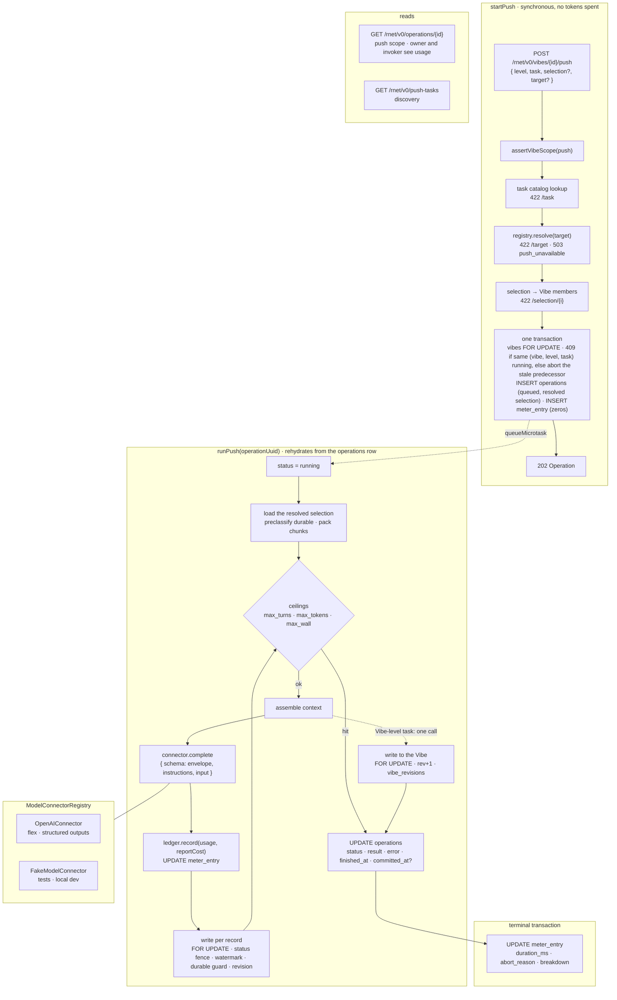

# Push pipeline

**Status:** Draft M3 implementation plan for review. No implementation is included in this document.

**Companion docs:** [implementation plan](../IMPLEMENTATION_PLAN.md) §3 (Inference, Agent harness), §5.1, §8 M3; [conformance status](../CONFORMANCE.md); rNet spec §2.3, §2.4, §3.2, §4.3, §6.2.

**Base:** `main` at `07f9434`. Branch `m3/01-push-pipeline`, one PR to `main`.

## 1. Purpose

Make `POST /rnet/v0/vibes/{id}/push` a real asynchronous operation: accept, return an `Operation` handle, run a store-defined task through a swappable `ModelConnector` (first connector OpenAI, `gpt-5.6-luna`, flex tier), land results under `rhizome:{task}` in element-, object-, and Vibe-level `inferred` blocks without ever replacing a `durable: true` entry, and persist one `meter_entry` row per run so cost is queryable.

M3 ships five tasks (§5.3): `summarize` and `vibe_view` at the Vibe level; `display_name` and `search_keywords` at the object level; `describe_media` at the element level. Tasks see the **observed shape** of objects; `type` is a hint that prompts and rules may use, never a gate that keeps an object out of a task, because many Vibes will hold dMachine-defined, often polymorphic object types the store has never heard of.

Adding a task means adding a directory under `apps/server/src/push/tasks/{level}/` (manifest, prompt, output schema, optional rules) and one line in `installed-tasks.ts`; no module outside `tasks/` and `installed-tasks.ts` knows a task name. The five M3 tasks between them cover every variation the manifest allows: element-, object-, and Vibe-level; text-only and image input; model-only (every run is a provider call) and rules-first (a deterministic `rules` function decides clear-cut cases, per Vibe from the `VibeContext` or per object from its shape, and the model is called only for what it leaves unanswered).

### Exit test (plan §8 M3, as assertions the suite proves)

| Criterion               | Proof                                                                                                                                                                                                                                              |
| ----------------------- | -------------------------------------------------------------------------------------------------------------------------------------------------------------------------------------------------------------------------------------------------- |
| inferred blocks present | after each object or element task, every applicable record has `inferred["rhizome:{task}"]` with a valid envelope; after each Vibe task, `vibes.inferred["rhizome:{task}"]` exists and the Vibe validates against `vibe.json`                      |
| costs queryable         | `SELECT payer, model, tokens_in, tokens_out, usd FROM meter_entry m JOIN operations o ON o.uuid = m.operation_uuid` returns one row per push with `usd` matching the rate-card arithmetic                                                          |
| connector swappable     | the integration and black-box suites run on `FakeModelConnector` injected through `AppDependencies`; the OpenAI connector is exercised only by stub-fetch unit tests; a grep test proves nothing outside `inference/openai/` imports provider code |
| per-run cost visible    | done, failed, and aborted runs each leave a closed `meter_entry` row; the owner sees `result.usage` on `GET /operations/{id}`                                                                                                                      |
| CONFORMANCE M3          | a seeded `durable: true` entry at the same key survives a push byte-identical; entries under every other key survive untouched                                                                                                                     |
| keyless CI              | `bun run check` and `bun run test:e2e` pass with no `OPENAI_API_KEY`                                                                                                                                                                               |

## 2. What the review found

A five-lens audit of plan, spec, schemas, and code produced 19 verified findings. The adversarial pass reframed all of them as implementation constraints rather than contradictions between authoritative sources.

The constraints that shape the design (each maps to a section below):

| Finding                                                                                                                                                         | Resolution                                                                                              |
| --------------------------------------------------------------------------------------------------------------------------------------------------------------- | ------------------------------------------------------------------------------------------------------- |
| No write path can land `rhizome:{task}`, cite the operation, or enforce the durable rule for user-invoked task output (`media-object-service.ts` `setInferred`) | Internal store writer, §7                                                                               |
| Polling a push needs `read`; starting it needs only `push`; push errors are unredacted (`operation-service.ts` falls through to the `read` branch)              | PUSH-scope branch and redaction, §6.5                                                                   |
| `meter_entry.payer` is NOT NULL and no payer policy exists yet                                                                                                  | The store pays for everything in the alpha: `payer = 'rhizome'`, attribution through `invoked_by`, §8.1 |
| No Vibe-level inferred write path anywhere                                                                                                                      | `writeVibeTaskInferred`, §7.4                                                                           |
| Batch tier needs a poller the in-process lifecycle cannot host before M7                                                                                        | Flex only, §4.3                                                                                         |
| OpenAI strict mode accepts a JSON Schema subset                                                                                                                 | Authoring rules asserted at load, §5.5                                                                  |
| Rate-card numbers in the plan are already stale for Sol                                                                                                         | Rate card with provenance lives in the connector, §4.3                                                  |
| No provider config surface; CI has no key; generator builds the app with a stub config outside tsc                                                              | Optional config, injectable registry, 503 when absent, §4.5–4.6                                         |
| Three model-identifier spellings                                                                                                                                | `model:{provider}/{name}` on the wire, `{provider}/{name}` stored, §4.2                                 |
| One `meter_entry` row per operation while object tasks make N calls                                                                                             | Ledger accumulates, `breakdown.calls` per call, §8.2                                                    |
| Plan says context reads `users.inferred`; nothing writes it                                                                                                     | Not read in M3, deferred with a leak-policy question, §12                                               |
| Host `useOperation` refreshes only the Vibe queries on `committed_at`                                                                                           | Push sets `committed_at` and the host invalidates the records the result names, §6.4, §10               |
| Playwright lane is a mocked store with no DB                                                                                                                    | Exit criteria proven in `bun test`; e2e is a regression gate plus the host panel's mock, §11            |
| `rhizome` writer name is only protected by dMachine-name uniqueness                                                                                             | `STORE_WRITER` constant in store-contract; reservation is M6/M7 registration work                       |

## 3. Architecture



The accept path is cheap and spends nothing; a run is a loop of assemble, complete, record, write, with the ledger updated before every write so a crash loses a write, never a recorded charge. The run rehydrates from the `operations` row alone (§6.4a).

The loop drawn is the object-level path (`display_name`, `search_keywords`). An element-level task (`describe_media`) runs the same loop over the image and video elements of the selected objects, deduplicated by element UUID, and writes per element (§7.3). A Vibe-level task (`summarize`, `vibe_view`) takes the dotted branch and shares everything up to and including the connector call and the ledger. It differs in four places:

- one call, never chunked, and no `selection` (it describes the whole Vibe): the `VibeContext` (§5.2) followed by every member's per-object context, and oversize context truncates from the end rather than fanning out;
- a Vibe-level `rules` short-circuit sees the whole `VibeContext` (`vibe_view`), where an object-level one sees one object at a time and only that object skips the call;
- the write targets the `vibes` row (`rev + 1`, a `vibe_revisions` snapshot) instead of one transaction per object;
- the result carries a single `vibe.outcome` instead of per-object outcomes.

An element-level task reports per-element outcomes under `elements` (`written`, `preserved`, `skipped` with the same reasons) alongside the per-object `no_input` skips.

## 4. ModelConnector boundary

### 4.1 Layout

```
apps/server/src/inference/
  model-connector.ts            interface, ModelUsage, CostReport, ModelConnectorError, target grammar
  connector-registry.ts         ModelConnectorRegistry, createModelConnectorRegistry
  structured-output-schema.ts   assertStructuredOutputSchema(): the strict subset (§5.5)
  fake-connector.ts             FakeModelConnector (tests, local dev)
  openai/
    connector.ts                raw fetch to /v1/responses, retries, timeouts, parsing, usage mapping
    responses-api.ts            wire types for the request and the response subset we read
    rate-card.ts                nano-USD integers with source URL + verifiedAt; priceUsage()
```

No `openai` npm package: one endpoint, structured outputs, and a usage block are a few hundred lines with an injected `fetch`, and it keeps "swapping providers touches one file" literally true. `test/inference-boundary.test.ts` greps that nothing outside `inference/` imports `inference/openai/` and that `config.ts` imports only `inference/config.ts`. The registry lives in `inference/`, not `push/`, so M5 shares provider configuration, model naming, and usage normalization with the harness from one place; the harness itself executes natively through Pi (plan §3) and does not call `complete`.

### 4.2 Interface

```ts
// A push target on the wire: "model:{provider}/{name}", e.g. "model:openai/gpt-5.6-luna".
// The provider is a lowercase slug; the name is whatever the provider calls its model.
export const MODEL_TARGET_PATTERN = "^model:[a-z][a-z0-9-]*/[A-Za-z0-9][A-Za-z0-9._-]{0,127}$";
export interface ModelTarget {
  provider: string;
  name: string;
}
export function parseModelTarget(target: string): ModelTarget;
export function modelIdentity(t: ModelTarget): string; // "openai/gpt-5.6-luna": meter_entry.model and inferred.model

export interface CompletionRequest {
  target: ModelTarget;
  instructions: string;
  input: string;
  schema: JSONSchema; // the batch envelope or output.json for this call, in the provider's strict-mode subset (§5.5)
  schemaName: string; // provider-facing label for the format, [A-Za-z0-9_-]{1,64}, e.g. rhizome_search_keywords
  effort: "low" | "medium" | "high";
  maxOutputTokens: number;
  timeoutMs: number;
  signal: AbortSignal;
  trace: { operationUuid: string; call: number };
}
export interface ModelUsage {
  tokensIn: number;
  cachedTokensIn: number;
  cacheWriteTokensIn: number;
  tokensOut: number;
  reasoningTokensOut: number;
  servedTier: string | null;
  providerModel: string | null;
  providerRequestId: string | null;
  durationMs: number;
  attempts: number;
}
export interface CompletionResult {
  output: unknown;
  usage: ModelUsage;
}
export type ModelConnectorErrorKind =
  | "auth"
  | "invalid_request"
  | "rate_limited"
  | "provider_unavailable"
  | "timeout"
  | "aborted"
  | "output_truncated"
  | "output_refused"
  | "output_invalid"
  | "unsupported";
export class ModelConnectorError extends Error {
  kind: ModelConnectorErrorKind;
  retryable: boolean;
  status?: number;
  providerRequestId?: string;
  usage?: ModelUsage; // present whenever the provider produced a billable response
}
export interface CostReport {
  usd: string /* 6-dp decimal */;
  rateCard: { id; source; verifiedAt; tier; longContext };
}
export interface ModelConnector {
  provider: string;
  models: readonly string[];
  complete(r: CompletionRequest): Promise<CompletionResult>;
  countTokens(i: { target; instructions; input }): Promise<{ tokens: number; exact: boolean }>; // packing estimate only
  reportCost(usage: ModelUsage, target: ModelTarget): CostReport; // pure; throws on unknown model/tier
}
```

Plan §3 also names `stream`; it is added in M5 with its first consumer (the harness and the SDK's `agent.stream`) rather than shipped now as a method nothing calls. `complete` hands `schema` to the provider's structured-output feature, parses, re-validates with a connector-private AJV, and throws `output_invalid` (with usage) on mismatch. It never returns unvalidated output and never returns a success without a usage block. Errors carry `usage` whenever the provider billed the call, which is what makes "every token metered" hold on refusal, truncation, and invalid output.

### 4.3 OpenAI connector

- `POST {baseUrl}/v1/responses` with `service_tier: "flex"`, `store: false`, `instructions` = PROMPT.md, `input` = one user turn of assembled context, `text.format = { type: "json_schema", name, strict: true, schema }`, `reasoning.effort`, `max_output_tokens`, `metadata.rhizome_operation`.
- Parsing: `completed` → first `output_text` → JSON → AJV. `refusal` content part → `output_refused`. `status: "incomplete"` with `max_output_tokens` → `output_truncated`. `failed` → `provider_unavailable`. All with usage attached.
- Usage: `input_tokens`, `input_tokens_details.cached_tokens`, `cache_write_tokens`, `output_tokens`, `output_tokens_details.reasoning_tokens`, the echoed `service_tier` (verified: it can differ from the requested tier), `x-request-id`.
- Retries: ≤ 4 attempts on network errors, 408, 409, 429 (flex capacity shortfall is a 429 and is uncharged), 5xx; exponential backoff honoring `Retry-After`. 401/403 → `auth`; 400/422 → `invalid_request` (a rejected schema fails loudly, no retry). **Never** escalates to `service_tier: "default"`: that silently doubles the rate the plan budgeted. Per-call timeout 10 min (the flex guide recommends 15; the operation wall ceiling bounds the run).
- The OpenAI Batch API is a named non-goal: it needs persisted provider job ids and a restart-surviving poller, which is the durable-execution work CONFORMANCE defers to M7. Flex is priced at batch rates.
- Models: the connector serves the GPT-5.6 family (`gpt-5.6-luna`, `gpt-5.6-terra`, `gpt-5.6-sol`); Luna is the default because it takes text and image input, supports structured outputs on the Responses API, and is the cost tier the plan budgets. An unlisted model is rejected at `/target`, never priced at zero.
- Rate card (`rate-card.ts`): nano-USD per token with one row per served model, per tier and per long-context regime, with `id`, `source` URL, and `verifiedAt`. Priced against the **served** tier. Re-verify on the pricing page before merge; `verifiedAt` in every breakdown row makes a stale card visible in the data.

### 4.4 Fake connector

`FakeModelConnector` generates a schema-conformant instance deterministically (enum → first value, `["T","null"]` → `T`, string → `"fake"`, number → `0.5`), emits one envelope item per `ref` enum value so batches round-trip unscripted, accepts a `respond` override that may return a `ModelConnectorError` with usage to drive failure paths, records every request, and prices with the real Luna card so `usd > 0` in tests. Registered under the default target so tests never override `target`. Selectable for local dev with `RHIZOME_USE_FAKE_INFERENCE_PROVIDER=true`, refused in production.

### 4.5 Config

`ServerConfig` is the typed object `loadConfig()` builds from the environment in `apps/server/src/config.ts` and hands to `createApp`; it already carries `blob`, `sourceCredentials`, and the rest. M3 adds one optional section:

```ts
// apps/server/src/config.ts — names no provider, as it names no source skill
export interface ServerConfig {
  // …existing sections
  inference?: InferenceConfig;
}
// apps/server/src/inference/config.ts
export interface InferenceConfig {
  defaultTarget: string; // RHIZOME_PUSH_DEFAULT_TARGET, default "model:openai/gpt-5.6-luna"
  providers: ProviderSettings; // keyed record, one optional entry per provider: { openai?, anthropic? (M5) }; several may be present
  useFake: boolean; // RHIZOME_USE_FAKE_INFERENCE_PROVIDER, refused in production
}
export function loadInferenceConfig(env = process.env): InferenceConfig; // calls each provider's loader
// apps/server/src/inference/openai/config.ts
export function loadOpenAIProviderSettings(env): OpenAIProviderSettings | undefined; // OPENAI_API_KEY, OPENAI_BASE_URL; the tier is fixed at flex
```

This mirrors how `config.ts` handles credentialed sources: it calls `loadCredentialedSourceSettings` from the ingest module and stores the result without knowing SimpleFIN exists. Here `loadConfig` calls `loadInferenceConfig`, which calls each provider's own loader, so provider env names and validation live under `inference/{provider}/` and `config.ts` stays provider-blind. All variables are documented in `.env.example` and all are optional.

`inference` is optional because the OpenAPI generator and the four test suites build `ServerConfig` literals by hand; a required field would break all of them. When it is absent the server still boots, discovery works, and push answers 503 `push_unavailable` after the scope check.

### 4.6 Registry

```ts
// apps/server/src/inference/connector-registry.ts
export interface ModelConnectorRegistry {
  defaultTarget: string;
  resolve(target?: string): { connector; target; identity }; // 503 push_unavailable when empty; 422 /target when unserved
}
export function createModelConnectorRegistry(
  config: InferenceConfig | undefined,
): ModelConnectorRegistry;
```

`createModelConnectorRegistry` is the one place that maps a provider's settings to its connector class (`providers.openai` → `OpenAIConnector`; an Anthropic entry in M5), so several providers can be live at once and adding one touches this factory, a `config.ts` under the new provider directory, and nothing else. `RHIZOME_USE_FAKE_INFERENCE_PROVIDER=true` replaces the contents with `FakeModelConnector` for local development and is refused in production.

A push resolves its target in this order, and every candidate must be served by a registered connector: the request's `target`, then the task manifest's `defaultTarget`, then `InferenceConfig.defaultTarget`. Running one task on a different provider from the rest is therefore that task's manifest setting. Boot asserts the configured default target is served when any connector is registered, so a misconfiguration fails startup rather than the first push.

`AppDependencies` gains `modelConnectors?`, `pushTasks?`, and `pushLimits?`, each resolved to its default when not injected, the same way the ingestion catalogs are; tests inject the fake through `modelConnectors`.

## 5. Push tasks

### 5.1 Layout and registry

```
apps/server/src/push/
  task-catalog.ts       PushTaskDefinition, PushTaskCatalog (load-time validation), toManifest()
  installed-tasks.ts    installedPushTasks = new PushTaskCatalog([summarize, vibeView, displayName, searchKeywords, describeMedia])
  limits.ts             PushLimits + DEFAULT_PUSH_LIMITS
  markdown.d.ts         declare module "*.md" so tsc types the text imports
  context.ts            shape extraction, assembleObjectChunkContext, assembleVibeContext
  chunking.ts           packChunks, batchEnvelope, unpackResults
  push-service.ts       startPush / runPush
  tasks/                # one directory per level, then per task: identity is (level, name)
    vibe/
      summarize/        manifest.ts  PROMPT.md  output.json
      vibe_view/        manifest.ts  PROMPT.md  output.json  rules.ts
    object/
      display_name/     manifest.ts  PROMPT.md  output.json
      search_keywords/  manifest.ts  PROMPT.md  output.json
    element/
      describe_media/   manifest.ts  PROMPT.md  output.json
```

PROMPT.md and output.json stay real files and are loaded with `import prompt from "./PROMPT.md" with { type: "text" }` and a JSON import. Verified: both bundle under `bun build --target=bun` and run unbundled. No runtime filesystem read.

```ts
export interface PushTaskDefinition {
  name: string; // TASK_PATTERN; key = storeTaskKey(name)
  level: "element" | "object" | "vibe";
  label: string;
  description: string;
  elements: "none" | "metadata" | "bytes"; // how much of each element the model sees; bytes are fetched and attached (§5.4)
  hostRole?: "vibe_summary" | "vibe_view"; // closed PUSH_TASK_HOST_ROLES; lets the host find the summary and view tasks without knowing names
  prompt: string;
  outputSchema: JSONSchema; // one result; static; authored in the JSON Schema subset the provider's strict structured-output mode accepts (§5.5); serves discovery, re-validation, and (wrapped in the batch envelope) generation
  rules?: (input: VibeContext | ContextObject) => TaskOutput | undefined; // deterministic short circuit: a result matching outputSchema, or undefined to defer to the model; per Vibe for Vibe-level tasks, per object for object-level ones
  effort: Effort;
  maxObjectsPerCall?: number;
  outputTokens: { base: number; perObject: number };
  defaultTarget?: string; // per-task override of the store default (e.g. a stronger model for describe_media)
}
```

`PushTaskCatalog` wraps the installed definitions, keyed by `(level, name)`: the same name may exist at more than one level (an object-level and a Vibe-level `search_keywords`), and the written key is `rhizome:{name}` on both because the record kind already tells them apart. It throws at load on a bad name, a duplicate `(level, name)`, AJV compile failure, strict-subset violation, or empty prompt, and exposes two methods: `get(level, name)` for the pipeline, and `manifests()`, the serializable subset (`level, name, label, description, host_role, output_schema`) that `GET /push-tasks` returns.

### 5.2 Shape, not type

Context assembly derives an `ObjectShape` for every object: its `type` string (whatever it is), the flattened key paths of `source.properties` and `user.properties` to a bounded depth (3) with the JSON kind at each leaf and arrays marked by item kind, its `keys` names, and its element kinds and roles. The shape is context for the model and the input to `VibeContext.types[].pointers`; the model itself receives the full property JSON, nested values included, within the per-object size cap (§5.6). Applicability is the model's call, not a filter: every selected record is sent, and a task's prompt says when to return `null` for a record that does not make sense for it. `type` is one hint in the shape, never a gate, so a dMachine-defined `garden.plant` with an image element is as describable as a registered `transaction`.

Two primitives in `@rhizome/store-contract` let an inferred value refer to a record without copying it:

- **`RecordPointer`**: an RFC 6901 JSON Pointer into the object's own serialized document (`/source/properties/amount`, `/user/properties/note`, `/keys/fitid`, `/inferred/rhizome:display_name/properties/display_name`). A string with a `pattern`; `resolvePointer(document, pointer)` in the host returns `undefined` for a pointer a given object lacks, so consumers always have a fallback. Pointers never cross into another record: `/elements/N` yields the reference `{ uri, role }`, nothing deeper.
- **`ElementSelector`**: `{ roles?: Role[]; kinds?: ElementKind[]; limit?: number }`. `selectElements(document, selector)` returns every element reference matching the filter, in element order, up to `limit` (omit for all); the host fetches those elements as it already does and owns the layout, whether one tile or a grid. Zero matches is the empty state, not an error.

Vibe-level tasks and rules receive a `VibeContext`, the compact form of the whole Vibe, computed by one grouped query plus the per-type union of object shapes:

```ts
interface VibeContext {
  title: string;
  summary: string | null; // rhizome:summarize.summary, omitted for summarize itself
  objects: number;
  types: Array<{
    type: string;
    count: number;
    pointers: Array<{ pointer: RecordPointer; kind: JsonKind }>;
  }>; // per type: how many, and the observed pointers with leaf kinds, deduplicated and capped (64 per type; truncation reported in result.context)
  elements: Array<{ kind: "text" | "image" | "audio" | "video" | "document"; count: number }>;
}
```

`types[].count` and `elements[].count` are what rules key on; `types[].pointers` is what lets `vibe_view` name real properties without seeing every object.

### 5.3 The M3 tasks

Every task writes the envelope `{ model, inferred_at, confidence?, properties }` under `rhizome:{task}`; `confidence`, when a task emits it, is lifted into the envelope rather than duplicated. Every `output.json` below is static and strict-subset (§5.5). Length limits are expressed as `pattern` (for example `^.{1,80}$`), so they are enforced at generation and nothing is clipped after the fact.

**Object- and element-level tasks see only their own record.** An object can sit in many Vibes and shows the same blocks in each (spec §2.4), so its inferred output must not depend on which Vibe ran the push: no Vibe summary, no other writers' notes, nothing from outside the record (§5.6). **Vibe-level tasks describe the whole Vibe** and therefore reject `selection` (422 at `/selection`).

**`summarize` (Vibe).** One call over the `VibeContext` followed by the §5.6 per-object context of every member in position order. Output `{ summary: string (pattern ^[\\s\\S]{1,600}$), tags: string[1..8] (pattern ^[a-z0-9][a-z0-9-]{0,31}$), confidence }`. `summary` is written to be reused as context by later Vibe-level runs (spec §2.4, §4.3). Runs first by convention; the host offers it first (`hostRole: "vibe_summary"`). If the context exceeds the per-call input ceiling, objects drop from the end in Vibe order and `result.context.truncated_objects` reports how many; summarize never fans out.

**`vibe_view` (Vibe).** Chooses the host surface for the Vibe and the configuration that surface needs (`hostRole: "vibe_view"`). `output.json` is a root object with a discriminator and a config union:

```text
{ view: enum[dataframe, mediaboard, simplelist], config: anyOf[
  { columns: RecordPointer[1..8], sort: { pointer: RecordPointer, direction: asc | desc } | null },   // dataframe
  { media: ElementSelector, caption_pointer: RecordPointer | null },                                   // mediaboard
  { title_pointer: RecordPointer, subtitle_pointer: RecordPointer | null } ] }                         // simplelist
```

The schema is static: pointers are strings with the `RecordPointer` pattern, and the prompt receives the Vibe's observed pointers (`VibeContext.types[].pointers`) as the menu to choose from. After generation the pipeline checks that the `config` branch matches `view` and that every returned pointer is in the observed set; a miss is `invalid_output`. A Vibe with no usable pointers (objects whose properties are empty) falls back to `simplelist` with null pointers, and the host shows `rhizome:display_name` or the type and URI tail. The `view` values are `VIBE_VIEWS` in `@rhizome/store-contract`, which the host imports for its surface mapping; a unit test asserts the `output.json` discriminator matches the constant so adding a view in one place only fails CI. Persisted as `properties = { view, config }`.

Rules first: the `rules` function sees the `VibeContext` and decides clear-cut cases from the counts and pointers alone, filling the config deterministically; it may key on a registered type where that is the obvious answer (all `transaction` → `dataframe` with `columns = [/source/properties/posted_at, /source/properties/description, /source/properties/amount]` sorted by `posted_at` desc; all `arena.block` or `pinterest.pin` with image elements → `mediaboard` with `media = { kinds: ["image"], limit: 4 }`; one type, no elements → `dataframe` over its first eight observed pointers). The model is called only when the rule returns nothing, which is a mixed or unfamiliar Vibe, so a plain transaction Vibe costs nothing. A rule-decided entry is written with `model` set to the rule's identifier (`rhizome/vibe_view-rules@1`) rather than a provider model, and no ledger call is recorded. The rule table lives beside the manifest and is unit-tested.

**`display_name` (object).** A short human name for the object, derived from its own properties and element metadata; the prompt returns `null` for an object with nothing sensible to name. Output `{ display_name: string (pattern ^.{1,80}$) }`. An object has one name wherever it appears: the entry lives on the object and takes no Vibe input, so two Vibes never render the same object differently. It is also how element text becomes an object-level string a `RecordPointer` can reach.

**`search_keywords` (object).** Document expansion for the host's lexical search. Output `{ keywords: string[1..20] (pattern ^[a-z0-9][a-z0-9 .'&-]{0,47}$) }`. PROMPT.md requires every term to be grounded in the object's own properties or element metadata (synonyms, spellings, and category words a person would type; no invented facts, no personal identifiers not already present). Indexed through a GIN over the inferred JSONB; embeddings, when they come, are a store-built index (rnet-spec-v0.1.md §2.4), not an inferred entry.

**`describe_media` (element).** The selection is still objects; the pipeline collects their attachable elements (§5.4), deduplicated by element UUID and remembering which selected object each came from, so a shared element is described once. An object with no attachable element contributes nothing and is reported `no_input`. `elements: "bytes"`. `output.json` is one result per element: `{ caption: string (one line, pattern ^.{1,120}$), description: string (dense prose of what is in the frame and how it is arranged, pattern ^[\\s\\S]{1,1200}$), medium: enum[photo, screenshot, illustration, diagram, document_scan, other], subjects: string[0..10] (objects, places, brands; people as roles, never identities), text_in_image: string|null (verbatim legible text) }`; chunking wraps it in the ref envelope (§5.5) with refs `e1..eN` over the attached elements only, so each attachment gets exactly one description and non-visual elements are never referenced. The call receives only the element's intrinsic fields (kind, MIME, `alt`) and its bytes, never the parent object or Vibe. `caption` is what a list shows and `description` is what a later text-only run receives in place of the image; each result is written to its element as `inferred["rhizome:describe_media"]`.

### 5.4 Attachments

`CompletionRequest` gains an optional `attachments?: Array<{ ref: string; kind: ElementKind; mime: string; bytes: Uint8Array }>`. `elements: "bytes"` is defined for every element kind, not only images:

| Kind             | Attached as (OpenAI)   | M3 allowlist                                         |
| ---------------- | ---------------------- | ---------------------------------------------------- |
| `text`           | `input_text` part      | `text/*`                                             |
| `image`          | `input_image` data URL | `image/png`, `image/jpeg`, `image/webp`, `image/gif` |
| `document`       | `input_file` data URL  | `application/pdf`                                    |
| `audio`, `video` | not attachable in M3   | skipped as `unsupported_media`                       |

Before dispatch the pipeline checks each element's MIME against the allowlist for its kind and sniffs the payload's magic bytes; a mismatch or an unlisted type is `unsupported_media`, decided deterministically, never sent. Parts are ordered so the model can address them: the data block first, then for each attachment a text marker naming its ref (`e2`) immediately followed by the attachment part. Chunk packing counts attachments: a per-kind token estimate (images by the provider's published tile formula, text and documents by size) joins `countTokens` in the input ceiling, and `maxAttachmentBytes` / `maxAttachmentBytesPerCall` (§6.6) bound the bytes. The connector maps the parts; a connector that cannot accept a kind throws `unsupported` before any request; `FakeModelConnector` records attachments. `describe_media` is the only M3 task that attaches anything; text and document attachment is a live, tested path with no task yet.

### 5.5 Output schemas

`output.json` is static and serves discovery, pre-write re-validation, and generation. `assertStructuredOutputSchema` enforces the subset the configured connector supports, today OpenAI strict mode as verified on 2026-09-08: object root, `additionalProperties: false` on every object, every property in `required` (optionality is `["T","null"]`), allowed keywords `type enum const properties required additionalProperties items anyOf $defs $ref description pattern format(date-time,date,time,duration,email,hostname,ipv4,ipv6,uuid) minimum maximum exclusiveMinimum exclusiveMaximum multipleOf minItems maxItems`; forbidden `$schema $id title default examples minLength maxLength uniqueItems patternProperties allOf oneOf not if/then/else`. The concept is "the intersection the configured connector accepts", so a second provider's connector supplies its own check.

The only per-call construction is the batch envelope, `batchEnvelope(outputSchema, refs)`, which wraps one static `output.json` for a chunk: `{ results: [{ ref: enum[o1..oN], result: output.json | null }] }` with `minItems = maxItems = N`. It is a pure function unit-tested against the strict subset for every installed task at chunk sizes 1 and `maxObjectsPerCall`, and the pipeline runs `assertStructuredOutputSchema` on the materialized envelope before every dispatch. Refs are per-call ordinals, never URIs, so the model cannot address a record it was not given. Strict mode cannot enforce uniqueness, so after the envelope validates the pipeline checks that the set of returned refs equals `{o1..oN}` exactly: a duplicate, missing, or unknown ref fails the whole chunk as `invalid_output` and nothing from it is written (a duplicated ref means the model confused rows, so the rest cannot be trusted). Each non-null `result` is then re-validated against `output.json`.

`null` means the task does not make sense for that record; the pipeline writes nothing, reports `not_applicable`, and, if the record already holds a non-durable `rhizome:{task}` entry, removes it in the same locked write with a revision row. That is the only meaning of `null`, and every prompt states it; every other bad outcome is its own reason (§6.5).

### 5.6 Context assembly and injection posture

**Vibe-level tasks** receive the `VibeContext` (§5.2), whose `summary` is `rhizome:summarize.summary` when present (except for `summarize` itself, spec §6.2 independent re-derivation), followed by every member's per-object context.

**Object-level tasks** receive, per object: `type`, `source.properties` (strings cut at 512 units), `user.properties` (owner annotations are authoritative), element metadata (kind, role, the element's `alt`, and the element's own `rhizome:*` entries such as a `describe_media` caption and description; never bytes or URIs), and `notes` = the object's own store-authored `rhizome:*` entries other than the task's own. Nothing from the Vibe.

**Element-level tasks** receive the element's intrinsic fields (kind, MIME, `alt`) and, for bytes tasks, its payload. Nothing from the parent object or the Vibe.

Excluded everywhere: `source.ingest`, `source.origins`, `keys` values, `x-*`, the task's own prior output, every entry from any other writer (free text from a partially trusted principal is the injection vector, and the store cannot tell a real correction from injected text at the write boundary), and `users.inferred`. The owner's own assertions reach the model through `user.properties`.

Instructions live in `instructions`; data goes in the user turn as one JSON document inside `<data>…</data>`, and every PROMPT.md states that everything inside is record content. Output is schema-constrained at generation and re-validated twice, closed enums and pattern-bounded lengths bound content, the writer touches only `rhizome:{task}` on the records in the chunk, `store: false` provider-side, no tools offered.

## 6. Push operation

### 6.1 Contract (`@rhizome/store-contract`)

```ts
export const PUSH_TASK_LEVELS = ["element", "object", "vibe"] as const;
export const PUSH_TASK_HOST_ROLES = ["vibe_summary", "vibe_view"] as const;
export const STORE_WRITER = "rhizome" as const;
export type StoreTaskKey = `${typeof STORE_WRITER}:${string}`;
export function storeTaskKey(task: string): StoreTaskKey; // validates task against TASK_PATTERN
export const RECORD_POINTER_PATTERN = "^(/[^/~]*(~[01][^/~]*)*)+$"; // RFC 6901, non-empty
export const recordPointerSchema = { type: "string", pattern: RECORD_POINTER_PATTERN };
export const elementSelectorSchema = {
  /* { roles?: Role[], kinds?: ElementKind[], limit?: 1..64 }, additionalProperties false */
};
export function resolvePointer(document: MediaObject, pointer: string): unknown; // undefined when absent
export function selectElements(
  document: MediaObject,
  selector: ElementSelector,
): MediaObjectElementRef[];

export const pushVibeRequestSchema = {
  // Task identity is (level, task). Required rather than inferred so a name that exists at two
  // levels is never ambiguous; the host has both from discovery. The request branches on level
  // because selection is meaningful only for record-level tasks.
  anyOf: [
    {
      type: "object",
      required: ["level", "task"],
      additionalProperties: false,
      properties: {
        level: { enum: ["element", "object"] },
        // A bare task name, lowercase snake_case ("search_keywords"); TASK_PATTERN comes from
        // @rnet/types/patterns and is the task half of the inferred key grammar. The store adds
        // the writer prefix, so a client can never name another writer's namespace.
        task: { type: "string", pattern: TASK_PATTERN },
        selection: {
          type: "array",
          minItems: 1,
          maxItems: 500,
          uniqueItems: true,
          items: vibeSchema.properties.objects.items,
        },
        target: { type: "string", pattern: MODEL_TARGET_PATTERN },
      },
    },
    {
      type: "object",
      required: ["level", "task"],
      additionalProperties: false,
      properties: {
        level: { const: "vibe" },
        task: { type: "string", pattern: TASK_PATTERN },
        target: { type: "string", pattern: MODEL_TARGET_PATTERN },
      },
    },
  ],
};
export const pushTaskManifestSchema = {
  /* level, name, label, description, host_role (nullable), output_schema */
};
export const pushTaskManifestsResponseSchema = {/* { tasks: [...] } */};
// PROBLEM_CODES += "push_unavailable" | "operation_in_progress"; ProblemStatus += 409 | 503
// STORE_SCHEMA_COMPONENTS += PushVibeRequest, PushTaskManifest, PushTaskManifestsResponse (+ generator aliases)
```

One route for all three levels: push is one Vibe operation in the spec and the SDK sketch, discovery is one list, and the level is a required field; the request schema's branch on `level` is what makes `selection` invalid for a Vibe-level task at the validation boundary.

### 6.2 Routes

`POST /vibes/{id}/push` replaces the stub at `routes/vibes.ts:255-275`: `auth: user_or_client`, `202` Operation, `401/403/404/409/422/503`. New `routes/push-tasks.ts` at `GET /rnet/v0/push-tasks`, `auth: user_or_client` (a dMachine must be able to discover), mirroring `routes/source-skills.ts`, working with no provider configured.

### 6.3 `startPush`

1. `assertVibeScope(vibe, PUSH)` (owner implicit).
2. Task lookup by `(level, task)`, else 422 at `/task`.
3. `registry.resolve(target)`, else 422 at `/target` or 503.
4. Resolve the workset. Selection URIs → members of this Vibe, else 422 at `/selection/{i}`; omitted = every member in position order. For element-level tasks, collect the selected objects' attachable elements (§5.4), deduplicated, each remembering its selected parent object. Records whose `rhizome:{task}` entry is already `durable: true` are classified `preserved_durable` now and never sent (the locked guard in §7 still catches a durable entry that lands mid-run); objects with nothing attachable are `no_input`. `> maxObjects` → 422 at `/selection`. A workset with nothing left to send is still accepted: the run completes immediately as `done` at zero cost with its outcomes reported (§6.4).
5. One transaction: `SELECT vibes FOR UPDATE`; if an operation with the same `(vibe, level, task)` is `queued` or `running` and newer than `maxWallMs + 60 s` → 409 `operation_in_progress`; if one is older than that it is stranded (the process that owned it is gone), so the same transaction marks it `aborted` with `abort_reason: "max_wall"` and closes its ledger, and the new run proceeds. Insert `operations{kind: push, status: queued, invokedBy: actor.subject, ownerUuid: vibe.ownerUuid, vibeUuid, request}` and `meter_entry{payer: "rhizome", model, zeros}`.
6. `queueMicrotask(runPush)`; every exit path goes through the one finalizer (§6.4).

Stored `request`: `{ mode: "push", level, task, target, vibe: "rnet://vibe/…", selection: [object uuids in order], elements: [{ uuid, parent }] | null, outcomes_before_run: { preserved_durable: [...], no_input: [...] } }`. The selection is always the resolved ordered list, never `null`, so the run is reproducible from the row alone even after membership changes or the Vibe's deletion.

### 6.4 `runPush`

Status `running`; load the resolved workset from the row; pack chunks by count and estimated tokens, attachments included (a single record over the ceiling → `context_too_large`). Per chunk: check ceilings, assemble (recording each object's `source_rev` and `user_rev` as its **watermark**), `complete`, then `ledger.record` before any write, validate the envelope and the ref set (§5.5), re-validate each result, write per record (§7). A chunk-level `output_*` or exhausted `provider_unavailable`/`timeout`/`rate_limited` marks that chunk's records `call_failed` (with the connector error kind as `code`) and the run continues; `auth` and `invalid_request` fail the run; `aborted` from the wall ceiling marks the remaining records `aborted`. Element level: the same loop over the resolved elements, writing per element. Vibe level: one call, then `writeVibeTaskInferred`.

**Finalizer.** One idempotent function for every exit (normal end, ceiling, thrown error, stale-fence detection): it derives the outcome tally from what was actually written (the revisions carrying this `operation_uuid`, plus the in-memory outcomes), then in one transaction sets `operations{status, result, error, finished_at, committed_at}` and `meter_entry{duration_ms, abort_reason, breakdown}`. `committed_at` is set when at least one write or removal landed, aborted runs included, so the host refreshes exactly when data changed.

**Status matrix.** The final status is a function of what happened, not of how the run exited:

| Condition                                                                       | Status    | `abort_reason`                          |
| ------------------------------------------------------------------------------- | --------- | --------------------------------------- |
| every chunk ran; any mix of written, removed, preserved, skipped, `call_failed` | `done`    | null                                    |
| nothing to send after accept-time classification                                | `done`    | null (zero cost)                        |
| a ceiling stopped scheduling before every chunk ran                             | `aborted` | `max_turns` / `max_tokens` / `max_wall` |
| the successor's fence marked this run stale                                     | `aborted` | `max_wall`                              |
| `auth`, `invalid_request`, or an unexpected exception                           | `failed`  | null; `error` set                       |

### 6.4a Durable execution readiness

Everything runs in the API process for the alpha; scaling is a later problem. CONFORMANCE's M7 entry moves preview and pull to durable execution with a reaper, and push rides that same move rather than getting its own queue. Four constraints keep that move a relocation instead of a rewrite, and the implementation must not drift from them:

- `startPush` does all synchronous work (auth, task, target, workset, operation row, ledger open); `runPush(operationUuid)` rehydrates from the `operations` row alone (task, target, the resolved selection and elements all live in `request`), so a worker can call it with nothing but the id.
- Writes are per record and the ledger is updated per call, so partial progress is durable and visible; a restarted run re-runs from the row (resumption at chunk granularity is M7 work, since a `null` or a preserved entry leaves nothing to resume from).
- The same-`(vibe, level, task)` guard is time-bounded and fenced by `operations.status` (§7.2), not lock-based; a queue can replace it with a lease later.
- The connector and registry are stateless: no in-process queues, no per-process state beyond the request.

Not in M3: a jobs table, lease columns, a worker binary, or any scheduling. Those are M7 decisions.

### 6.5 Result and visibility

A completed push's `result`, as returned inside the operation document by `GET /operations/{id}`, for a `search_keywords` run over 8 selected objects (one was already durable, so 7 were sent; `failed` counts the `call_failed` entries):

```json
{
  "task": "search_keywords",
  "target": "model:openai/gpt-5.6-luna",
  "model": "openai/gpt-5.6-luna",
  "objects": {
    "selected": 8,
    "sent": 7,
    "written": 3,
    "removed": 1,
    "preserved_durable": 1,
    "skipped": 2,
    "failed": 1
  },
  "written": [
    {
      "uri": "rnet://object/0198f2a1-0000-7000-8000-000000000001",
      "key": "rhizome:search_keywords",
      "rev": 3
    },
    {
      "uri": "rnet://object/0198f2a1-0000-7000-8000-000000000002",
      "key": "rhizome:search_keywords",
      "rev": 1
    },
    {
      "uri": "rnet://object/0198f2a1-0000-7000-8000-000000000003",
      "key": "rhizome:search_keywords",
      "rev": 2
    }
  ],
  "preserved": ["rnet://object/0198f2a1-0000-7000-8000-000000000004"],
  "skipped": [
    {
      "uri": "rnet://object/0198f2a1-0000-7000-8000-000000000005",
      "reason": "not_applicable",
      "removed": true
    },
    { "uri": "rnet://object/0198f2a1-0000-7000-8000-000000000006", "reason": "not_member" },
    { "uri": "rnet://object/0198f2a1-0000-7000-8000-000000000007", "reason": "input_changed" },
    {
      "uri": "rnet://object/0198f2a1-0000-7000-8000-000000000008",
      "reason": "call_failed",
      "code": "output_truncated"
    }
  ],
  "vibe": null,
  "elements": null,
  "llm_calls": 1,
  "usage": {
    "tokens_in": 1180,
    "cached_tokens_in": 0,
    "tokens_out": 96,
    "usd": "0.000176",
    "served_tier": "flex"
  },
  "context": { "truncated_objects": 0, "truncated_pointers": 0 },
  "abort_reason": null
}
```

`vibe` and `elements` are the slots for the other two task levels and are `null` when unused, so every result has the same shape; `llm_calls` is the number of provider requests the run made (the same count as `meter_entry.turns`), `0` when a rule answered without the model. The tally counts a `null` with a removal under both `removed` and `skipped`.

`skipped[].reason` is one of: `not_applicable` (the model returned `null`; `removed: true` when an older non-durable entry was deleted as a result), `no_input` (a bytes task and the object has nothing attachable), `unsupported_media` (kind or MIME not attachable in M3, or over `maxAttachmentBytes`), `context_too_large` (one record exceeds the per-call input ceiling on its own), `invalid_output` (the chunk's envelope, ref set, or a result failed validation; nothing from the chunk is written), `call_failed` (the chunk's provider call failed, with the connector error kind as `code`), `input_changed` (the record's `source` or `user` block changed between assembly and the locked write), `not_member` (the object left the Vibe, or the element or object was tombstoned, before the locked write), `aborted` (a ceiling or the fence stopped the run before this chunk ran). This list is a starting point and is extended during implementation as the code needs. For a Vibe-level task, `vibe` is `{ outcome: "written" | "removed" | "preserved_durable", key, rev }`.

**Visibility.** `OperationsService.getOperation` gains a `kind === "push"` branch asserting PUSH scope, so a push-only grantee can poll the handle it was returned; it also computes `canRead` (READ scope on the Vibe, owner implicit) and `isInvoker` (`actor.subject === invoked_by`), and `serializeOperation` takes `{ isOwner, isInvoker, canRead }` instead of one boolean. The owner sees everything. `usage` is shown to the owner and the invoker (a dMachine that triggered a run should see what it cost even though the store pays). Record URI lists (`written`, `preserved`, `skipped`) and the whole-Vibe tallies reveal membership, which the `read` scope protects, so they are shown only with `canRead`; a push-only grantee sees `task`, `target`, `model`, `llm_calls`, `abort_reason`, and `vibe.outcome`. `error` collapses to a generic sentence for anyone but the owner (provider messages may echo prompt fragments).

### 6.6 Ceilings (`push/limits.ts`, server policy, code constants overridable by injection)

| Limit                       | Default     | Effect                                                             |
| --------------------------- | ----------- | ------------------------------------------------------------------ |
| `maxObjects`                | 500         | 422 at accept                                                      |
| `maxObjectsPerCall`         | 25          | chunk size                                                         |
| `maxInputTokensPerCall`     | 24 000 est. | chunk size; keeps every call far below the 272K long-context cliff |
| `maxCalls`                  | 40          | `abort_reason: "max_turns"`                                        |
| `maxTokens`                 | 400 000     | `"max_tokens"`                                                     |
| `maxWallMs`                 | 900 000     | `"max_wall"`, aborts the in-flight call                            |
| `maxAttachmentBytes`        | 8 MiB       | larger payloads skip as `unsupported_media`                        |
| `maxAttachmentBytesPerCall` | 32 MiB      | chunk size for bytes tasks                                         |

The abort vocabulary is the plan's, unchanged. Budgets are out of M3's scope.

## 7. Writing results to inferred

### 7.1 Module (`services/inferred-writer.ts`)

Internal, no route. `MediaObjectsService.setInferred` is left untouched: it is the `write:inferred` path for external subjects and must keep deriving the writer from the actor. The store writer fixes the key via `storeTaskKey`, never emits `durable`, and strips any `durable`/`model`/`inferred_at` a model may have produced.

```ts
export async function writeObjectTaskInferred(
  db,
  { vibeUuid, mediaObjectUuid, task, entry, operationUuid }, // actor is always STORE_ACTOR ('rhizome', apps/server/src/rnet.ts)
): Promise<WriteOutcome>;
export async function writeElementTaskInferred(
  db,
  { vibeUuid, mediaElementUuid, task, entry, operationUuid },
): Promise<WriteOutcome>;
export async function writeVibeTaskInferred(
  db,
  { vibeUuid, task, entry, operationUuid },
): Promise<WriteOutcome>;
// WriteOutcome = { outcome: "written"; rev } | { outcome: "removed"; rev } | { outcome: "preserved_durable" } | { outcome: "not_member" } | { outcome: "input_changed" } | { outcome: "stale_run" }
// "removed": the model returned null and an existing non-durable entry was deleted, with a revision row.
// Every writer takes the record's assembly-time watermark { sourceRev, userRev } (objects only) and the operation uuid.
```

### 7.2 Object algorithm (one transaction per object)

```
BEGIN
  IF (SELECT status FROM operations WHERE uuid = $op) <> 'running' → ROLLBACK, stale_run   -- the fence (§6.3 step 5)
  locked = SELECT media_objects WHERE uuid = $1 FOR UPDATE          -- serializes with PUT /objects/{id}/inferred and PATCH /user
  IF not a member of $vibe OR tombstoned → ROLLBACK, not_member
  IF locked.source_rev <> $watermark.sourceRev OR locked.user_rev <> $watermark.userRev → ROLLBACK, input_changed
  IF locked.inferred[key]?.durable === true → ROLLBACK, preserved_durable   -- CONFORMANCE M3
  next = entry === null ? omit(locked.inferred, key) : { ...locked.inferred, [key]: entry }   -- built from the LOCKED row, touches only its key
  IF entry === null AND key not in locked.inferred → ROLLBACK, not_applicable (nothing to remove)
  assert ajv(mediaObjectSchema.properties.inferred)(next)
  rev = max(rev)+1 FROM media_object_revisions WHERE block = 'inferred'
  UPDATE media_objects SET inferred = next
  INSERT media_object_revisions (block 'inferred', rev, next, actor = 'rhizome', operation_uuid = $op)
COMMIT → written | removed
```

Per object rather than per chunk so a durable preserve or a concurrent removal never rolls back neighbours and spend is never wasted. Merging against the locked row, not the assembly snapshot, is what keeps another client's entry or another task's `rhizome:*` entry that lands mid-run; the watermark check is what keeps a `user.properties` edit made during the call from being overwritten by output derived from the old value. The membership recheck defends the grant, not the data: an object that left the Vibe mid-run could safely carry the entry (object output is Vibe-independent, §5.3), so no lock ordering with `removeMediaObjectRefs` is added in M3. Revision `actor` is `rhizome`: the store composed the prompt, chose the model, and wrote the entry, and bare `rhizome` is the store's one identity string as actor, invoker, and payer (a `rhizome:x` spelling would look like an inferred key). Who triggered the run is one join away through `operation_uuid` → `operations.invoked_by`.

### 7.3 Element algorithm

`writeElementTaskInferred` follows the object algorithm against `media_elements` (fence, FOR UPDATE, durable guard, whole-block validation against `media-element.json`'s `properties.inferred`, `UPDATE media_elements SET inferred`, a `media_element_revisions` row with `block = 'inferred'`, `rev = max + 1`, `actor = 'rhizome'`, and `operation_uuid`). There is no watermark (element payload and metadata are immutable). The recheck is against the element's _selected parent_ recorded in the request: that object must still be a member of the Vibe and neither it nor the element may be tombstoned, else `not_member`.

### 7.4 Vibe algorithm

Same shape on `vibes` with `rev = rev + 1` and a `vibe_revisions` row via `snapshotVibe` (moved to `services/vibe-snapshot.ts` so `VibesService` and the writer share it). This is the first write path for `vibes.inferred`; it lives here so push can never touch title, pull, or grants. `vibe_revisions` gains an `operation_uuid` column (§9) so Vibe-level writes link to their run the way object and element revisions do; pull's existing Vibe revisions leave it null.

### 7.5 Concurrency

Pushes with the same `(vibe, level, task)` are refused at accept (409) while one is running; a stranded predecessor is aborted by its successor and fenced out of further writes by the status check. Different tasks or Vibes run concurrently; per-record `FOR UPDATE` serializes them with each other and with `setInferred` and `setUser`. Two runs of the same task in sequence: later commit wins (spec §6.2), the earlier snapshot stays in the revision log.

## 8. Metering

### 8.1 Payer

The store pays for everything in the alpha. Every `meter_entry` row is written with `payer = 'rhizome'`, the spelling plan §3 reserves for the store's own account, and nothing reads a dMachine manifest's `metering` block or enforces `budget_usd_per_user_month`. Attribution is unaffected: `operations.invoked_by` still records who triggered every run, and `operations.owner_uuid` records whose Vibe it ran on, so "what does this dMachine cost across users" is one query grouped by `invoked_by` and "what did this user's Vibes cost this month" is one grouped by `owner_uuid` (§8.4). The developer-pays and user-pays policies are set aside in `impl/speculative/metering-payers.md`; the column is already there for them, and M3 rows are disposable alpha data that never need re-attributing. No seed change.

### 8.2 Ledger (`metering/meter-ledger.ts`)

`open` inserts the row with zeros in the accept transaction; `dispatch` appends `{ index, status: "dispatched" }` to `breakdown.calls` before each provider request, so a charge the process never saw a response for is visible as a dispatched call with no usage; `record` fills that entry after **every** provider response that carried usage (success, `output_invalid`, `output_truncated`, `output_refused`), adding tokens and `usd` (BigInt nano-USD rendered as a 6-dp string) and incrementing `turns`; `close` runs in the terminal transaction with `duration_ms` and `abort_reason`. A failure after chunk 2 of 5 leaves chunks 1–2 written and recorded and chunk 3's usage recorded if a response reached us; in-flight calls aborted by the wall ceiling are counted in `breakdown.totals.unmetered_in_flight_calls`.

### 8.3 Breakdown

`{ version, status, task, target, requested_tier, rate_card{id, source, verified_at}, invoked_by, calls[{index, objects, outcome, attempts, provider_request_id, served_tier, long_context, tokens…, duration_ms, usd}], totals{…} }`. Columns remain the queryable aggregate; dimensions and provenance live in `breakdown` so any row can be re-priced. No columns added.

### 8.4 Queries that prove the exit test

```sql
SELECT o.uuid, o.status, m.payer, m.model, m.tokens_in, m.tokens_out, m.turns, m.usd, m.abort_reason
FROM meter_entry m JOIN operations o ON o.uuid = m.operation_uuid WHERE o.uuid = $1;
SELECT o.owner_uuid, sum(m.usd) FROM meter_entry m JOIN operations o ON o.uuid = m.operation_uuid
WHERE o.created_at >= date_trunc('month', now()) GROUP BY o.owner_uuid;   -- what each user's Vibes cost
SELECT o.invoked_by, sum(m.usd) FROM meter_entry m JOIN operations o ON o.uuid = m.operation_uuid
GROUP BY o.invoked_by;                                                        -- what each dMachine costs
```

## 9. Data model changes

**One migration**, generated with `bun --filter @rhizome/server db:generate`: `vibe_revisions.operation_uuid uuid REFERENCES operations(uuid)`, nullable, so every revision kind links to the run that produced it. Everything else M3 writes fits the shipped schema: `operations.owner_uuid` (exists; push sets it to the Vibe's owner at accept), `media_elements.inferred` and `media_element_revisions` (exist, first written here), `operations` (kind `push` allowed), `meter_entry` (all columns), `media_object_revisions.operation_uuid` (exists, first written here), `vibes.inferred`. No seed change. Local reset stays `bun run db:migrate && bun run db:seed`.

Storage note: `inferred` stays a JSONB column in M3. Every read and write of it goes through the store writer and one read helper, and each write is keyed per entry against the locked row, so a later move to per-entry storage is a storage change, not a semantics change.

## 10. Host

Minimal and generic, in this PR (decision D5): `queries/push.ts` (`usePushTasks` from discovery, `usePushVibe`, reuse `useOperation`); a task control on `VibeSurface` that lists discovered tasks by label, runs one, and polls; the Vibe surface finds the summary and view tasks by `host_role`, never by name, renders `rhizome:summarize`, and maps `rhizome:vibe_view` to a surface with `resolvePointer` and `selectElements` from store-contract; `ObjectSurface` keeps its raw inferred block. When a push completes the host invalidates the Vibe and every object and element the result names, not only the Vibe list that `useOperation` refreshes on `committed_at`. To re-run a task on new objects only, the host selects the members lacking `rhizome:{task}`; the server has no freshness rule. Mock-store handlers for `GET /push-tasks`, `POST /vibes/{id}/push`, and a push branch in the operation mock, importing only `output.json` files (Playwright runs under Node and cannot load Bun text imports from `manifest.ts`); `apps/host/e2e/m3-push.e2e.ts` proves run → poll → refreshed inferred.

## 11. Tests

- **Unit (no DB):** strict-subset assertions over every installed `output.json` and a 25-ref envelope; OpenAI connector with injected `fetch`/`sleep`/`now` (request body, usage mapping, refusal/incomplete/invalid **with usage**, retry on 429 then 200, 4×503 → `provider_unavailable`, 401 no retry, never escalates tier, messages never contain the body); rate card (1M+1M at flex = `"0.700000"`, long-context flip, served tier overrides requested, unknown model throws); registry; fake connector; boundary grep; task catalog load and negatives; chunking and context rules (including "no summary in summarize's context", "no Vibe input in object or element context", and an injection string serialized unchanged as data); `batchEnvelope` strict-subset for every task at sizes 1 and max; ref-set equality (duplicate, missing, unknown → `invalid_output`); `vibe_view` rule table, the discriminator matching `VIBE_VIEWS`, branch-matches-view and pointer-in-observed-set checks, the no-pointer fallback; `resolvePointer` and `selectElements`; attachment allowlist, magic-byte check, part ordering, and ceilings; catalog accepts one name at two levels and rejects a duplicate `(level, name)`; `level` required and `selection` rejected for Vibe level at validation; ledger accumulation and the constant payer; config; serializer redaction; store-contract schemas and OpenAPI ids/components.
- **Integration (`push.integration.test.ts`, Postgres + S3rver, fake injected):** `search_keywords` over a Vibe with an image-only object present → entries on the applicable objects, the rest `not_applicable`, revisions with `operation_uuid`, meter row with rate-card `usd`; same-key durable preservation (seeded via Drizzle); a `null` result removes an existing non-durable entry with a revision row; `describe_media` writes to elements with `media_element_revisions` rows; gated-fake concurrency with `PUT /inferred` landing mid-run; a `PATCH /user` landing mid-run yields `input_changed` and no write; a stranded predecessor is aborted by the successor and its late write is fenced (`stale_run`); an all-durable selection completes `done` at zero cost; the finalizer sets `committed_at` for a removal-only run; summarize writes the Vibe and validates; second summarize does not receive the first's summary; partial failure keeps chunk 1 and meters chunk 2; `auth` → `failed` with a closed ledger; ceilings → `aborted` with `max_turns`; a client-invoked push is metered with `payer = 'rhizome'` and `invoked_by = client:{name}`; 409 while active; 503 keyless after 403 still wins; foreign-Vibe selection → 422.
- **Black-box (`rnet-semantics.test.ts`):** push requires and names the `push` scope; a push-only grantee sees no record URIs while a read grantee does; push writes land only in `inferred` under the store's namespace; a push never replaces a durable entry or another writer's key; push output is never durable; a later run replaces only its own key; a push-only grantee can invoke and poll, a read-only grantee cannot invoke; task names are discoverable; an unlisted target is rejected with a pointer; a Vibe-level task lands in the Vibe and the Vibe still conforms; every push is metered; a store with no provider answers 503.
- **Playwright:** existing gate unchanged plus `m3-push.e2e.ts` against the mock store, covering a Vibe task, an object task, and `describe_media`, and asserting the object and element queries refresh.
- **Deliberately not tested in CI:** the live OpenAI API (an out-of-CI smoke script may follow), restart recovery (M7), budgets.

## 12. Deferred and out of scope

OpenAI Batch API tier and any poller (M7 durable execution); reaper; `ops.push` SDK bridge (M4); developer-pays and user-pays metering and budgets (`impl/speculative/metering-payers.md`); `users.inferred` read or write, which needs a writer and a leak policy for client-invoked pushes; second connector and real `stream` callers (M5); reserved writer names at registration (M6/M7); a task that consumes text or document attachments (the path exists, no M3 task uses it); audio and video analysis, which wait for durable execution and a worker for frame extraction and never run in the API process; tier fallback to standard.

## 13. Implementation sequence

Each commit keeps `bun run check` green; push returns 202 only from commit 6.

1. contract: push request, task manifests, `STORE_WRITER`, target pattern, problem codes and statuses, generator aliases, regenerated `openapi.ts`
2. config: optional inference block, `.env.example`, README paragraph, config tests
3. inference: `ModelConnector`, registry, strict-subset check, fake connector, boundary test
4. inference: OpenAI Responses connector with flex tier, retries, usage mapping, rate card
5. push: task catalog, shape extraction and `VibeContext`, context assembly, chunking, `summarize`
6. push: `vibe_revisions.operation_uuid` migration, store writer, ledger, operation lifecycle, routes, visibility, app wiring, integration suite
7. tasks: `vibe_view` (with rules), `display_name`, `search_keywords`
8. semantics: push rules in `rnet-semantics.test.ts`
9. host: push queries, task control, `vibe_view` → surface mapping, mock-store handlers, `m3-push.e2e.ts`
10. inference + tasks: attachments on `CompletionRequest`, OpenAI `input_image`, `describe_media` (last, so everything before it can merge if it slips)
11. docs: this document finalized, CONFORMANCE M3 closed (M7 gains "push runs in-process", M5 "`users.inferred` warm-start policy")

## 14. Decisions

Settled with the owner before implementation; the sections above already reflect them.

| #   | Decision                                                        | Outcome                                                                                                  |
| --- | --------------------------------------------------------------- | -------------------------------------------------------------------------------------------------------- |
| D1  | Revision `actor` for push rows                                  | bare `rhizome`, the store's one identity as actor, invoker, and payer; plan comments normalized          |
| D2  | `vibe_revisions.operation_uuid`                                 | Added now, one migration                                                                                 |
| D3  | Who pays                                                        | The store pays for everything in the alpha; developer-pays and user-pays are set aside (speculative doc) |
| D4  | `GET /push-tasks`                                               | Shipped                                                                                                  |
| D5  | Host push control                                               | In this PR, minimal and generic                                                                          |
| D6  | `committed_at` on push                                          | Set at run end when ≥ 1 entry landed, aborted runs included                                              |
| D7  | Type `scripts/**` and stub `providerLeasePool` in the generator | Yes if it typechecks cleanly; dropped from the PR otherwise                                              |
| D8  | `vibe_view` views                                               | `dataframe`, `mediaboard`, `simplelist` to start, each with config (§5.3)                                |
| D9  | Usage visibility                                                | Owner and invoker                                                                                        |
| D10 | Same-`(vibe, level, task)` 409 guard                            | Included, with the stale-predecessor abort and the `status` fence                                        |
| D11 | Freshness rule                                                  | Removed; the host decides what to re-run                                                                 |
| D12 | Referencing record fields from inferred values                  | `RecordPointer` (JSON Pointer into the object's own document) and `ElementSelector`, in store-contract   |
| D13 | Per-call schemas                                                | None beyond the batch envelope; `output.json` is static and pointers are validated after generation      |
| D14 | Object and element context                                      | Record-intrinsic only; Vibe-level tasks reject `selection`                                               |
| D15 | Attachments                                                     | Defined per element kind (text, image, document); audio and video unsupported in M3                      |

## 15. Provider references

Verified 2026-09-08 (`platform.openai.com/docs/*` redirects to `developers.openai.com/api/docs/*`; append `.md` for raw markdown): structured outputs and the strict subset (`/guides/structured-outputs`), flex processing and the echoed `service_tier` (`/guides/flex-processing.md`, `/guides/priority-processing.md`), pricing for `gpt-5.6-luna` (standard $0.20 in / $1.20 out per 1M; flex and batch $0.10 / $0.60; cached input $0.01; long-context above 272K tokens 2× input and 1.5× output for the whole request; `/pricing.md`, `/models/gpt-5.6-luna.md`), usage object and prompt caching (`/guides/prompt-caching.md`), `store` and request ids (`/guides/your-data.md`, `/api-reference/debugging-requests.md`), OpenAI Batch API as a named non-goal (`/guides/batch.md`), error codes (`/guides/error-codes.md`).
