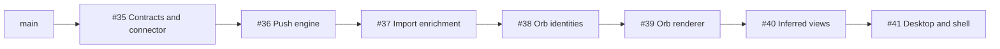

# M3 — seven-PR review handoff

This is the single shared context packet for independently reviewing the seven draft PRs split from [#33](https://github.com/2DM-technologies/rhizome/pull/33). No earlier chat history is required. Assign each review agent one GitHub PR number below. The numbered concepts are the seven approved boundaries; GitHub PR order follows actual dependencies.

## Published stack and merge order

- **[#35 — M3: define push contracts and the inference connector boundary](https://github.com/2DM-technologies/rhizome/pull/35)** (concept 1); base `main`.
- **[#36 — M3: execute and meter scoped push tasks](https://github.com/2DM-technologies/rhizome/pull/36)** (concept 2); base `m3/review-01-foundations`.
- **[#37 — M3: enrich confirmed imports through source-declared task graphs](https://github.com/2DM-technologies/rhizome/pull/37)** (concept 3); base `m3/review-02-push-engine`.
- **[#38 — M3: infer object orb identities and compose Vibe recipes](https://github.com/2DM-technologies/rhizome/pull/38)** (concept 5); base `m3/review-03-import-enrichment`.
- **[#39 — M3: render glass orbs with bounded live resources and raster caching](https://github.com/2DM-technologies/rhizome/pull/39)** (concept 6); base `m3/review-05-orb-identities`.
- **[#40 — M3: show inferred views, task progress, and tweet feeds](https://github.com/2DM-technologies/rhizome/pull/40)** (concept 4); base `m3/review-06-orb-rendering`.
- **[#41 — M3: retain the desktop and focus page windows in the shell](https://github.com/2DM-technologies/rhizome/pull/41)** (concept 7); base `m3/review-04-inferred-views`.



Agents may review all seven PRs concurrently. Merge in the order shown, preserve ancestry, and retarget/reconcile remaining bases after each merge. Do not squash a parent and assume GitHub will automatically preserve the downstream diff; compare the resulting merge base and file scope first. No merge, rebase, force push, deployment, or provider call is authorized by this review packet.

The backend status endpoints and generated contract belong with the engine. Source-confirmation UI and its browser expectations belong with the inferred views. The inferred-view hero consumes the renderer, which consumes the shared recipe schema and installed orb task metadata. Desktop integration and its browser cases come last. Shared files can appear in multiple PRs because each PR adds only its relevant changes.

## Immutable source and recovery

- Original feature branch: `m3/01-push-pipeline`, unchanged at `f75bd8e443d6fe7ee8cce905508d0e974876c958`.
- Original main/base: `220e289be5b064b6b5e80803c8a2f5e99698872c`.
- Complete application code head: `4606eeac426ed3a1998aae5c99710ee1a81f82b1` (desktop PR, before the documentation-only commit containing this packet).
- The final code tree and original feature tree are **identical Git tree objects**: `0f05054c92a31e86f928007bf8072bc6dec9acdc`. This proves the complete split preserves every tracked file, asset, and file mode from the original feature head.
- Original scope: 44 commits, 262 changed files, 25,129 insertions and 1,258 deletions, plus binary assets.
- Backup ref: `refs/backup/pre-split-20260914-220544`, commit `6e71545cc23084ee1ceb0d2efd8e453eb6dd9f59`; includes the original untracked review packet. Original branches and worktrees are preserved.
- Primary checkout: `/Users/noahputnam/2dm/rhizome`; split worktree: `/Users/noahputnam/2dm/rhizome-pr-split`.
- [#34 — Strava export ingestion](https://github.com/2DM-technologies/rhizome/pull/34) still depends on the original feature branch. It is outside this split. Do not retarget or rewrite it as part of review. The original #33 remains available as its base and as the complete historical diff.
- No CODEOWNERS, product-owner map, or PR template was found. Assignments follow code concerns. Read root `AGENTS.md` and nested guidance for touched paths.

PR #41 has a later documentation-only commit for this packet; its pinned code head above is intentional. Review the full base-to-code-head diff, and inspect any later PR commits separately rather than silently changing the review target.

## Copy/paste prompt for a new review agent

Replace `PR_NUMBER` with one of 35–41. Give the agent this whole file or the linked copy.

```text
Review Rhizome PR #PR_NUMBER using the complete handoff:
https://github.com/2DM-technologies/rhizome/blob/m3/review-07-desktop-shell/impl/reviews/m3-pr-review-handoff.md
Local copy: /Users/noahputnam/2dm/rhizome/impl/reviews/m3-pr-review-handoff.md

Find your PR's exact base/code-head revisions and complete file manifest below.
Review its incremental base-to-head diff, not the entire cumulative stack or only
its last commit. Read adjacent code and descendant integration as needed, but
distinguish defects introduced here from features intentionally added by later PRs.
The shared product decisions describe the finished stack.

This is an independent read-only code review. Preserve user work and local data.
Do not edit implementation, commit, push, rewrite history, open/merge PRs, publish
comments, reset data, or invoke live model/source providers. The shared dev server
on 5173 must remain running. Database tests truncate fixtures: use an explicitly
isolated test database. Coordinate browser suites that own port 4173.

Find actionable correctness, authorization, data-loss, resource-lifecycle, and
performance defects. Do not pad the report with style preferences or requests for
explicitly deferred features. Distinguish evidence, hypotheses, and known issues.

Return:
1. PR number, exact reviewed base/head, coverage, and exclusions.
2. Findings ordered by severity (P0 urgent universal failure, P1 high-impact
   blocker, P2 normal bug, P3 low-impact issue). For each: short title, file:line
   at the reviewed head, trigger, expected/actual behavior, impact, evidence or
   reproduction/test, minimal repair direction, and confidence.
3. Tests run, results, and environmental limitations.
4. Cross-PR dependencies and the PR that should own the repair.
5. Remaining uncertainty. If no actionable defect was found, say so clearly.

Known issues are listed in the packet. Do not report them as new independent
findings without adding evidence about cause or impact. Do not label an observed
failure flaky or change a timeout without establishing intended behavior.
```

## Product decisions and scope

Rhizome is the product Store and React host for rNet. The sibling `rnet` repository defines the protocol; Rhizome imports it, never the reverse. Bun/Hono/Postgres run the server, React/Vite/React Router run the host, and `packages/store-contract` carries browser-safe HTTP schemas. CI pins sibling rNet at `036288c4064fb978399c6cb3eaba8f0699afa37c`.

- Push is asynchronous at element, object, and Vibe levels, with server-enforced scope, deduplicated selections, strict output/ref validation, per-operation metering, row-locked inferred writes, and honest partial-failure results. Store tasks write their own `rhizome:{task}` key, preserve durable entries, and leave other writers intact.
- The seven installed task names are `describe-media`, `display-name`, `search-keywords`, `orb-identity`, `summarize`, `vibe-view`, and `vibe-orb`. The provider is optional; no live credentials/spend are needed for the deterministic gate. The configured default model is selected by server configuration, not by per-request choice.
- Source manifests declare an import task graph. The content graph starts with `describe-media → display-name → search-keywords`, then splits into `summarize → vibe-view` and `orb-identity → vibe-orb`. Ready nodes may overlap; settled failure unblocks later nodes. Empty graphs on transaction sources are intentional. Confirmed existing-Vibe imports enrich additions, refresh applicable whole-Vibe tasks, and retain the owner's title.
- Object `orb-identity` version 1 supplies reusable palette/field/surface/motion character. Shared Vibe recipe version 3 is deterministically composed from distinct saved object identities with a stable seed. `vibe-orb` is a rules task; the former Vibe-level image-sampling/semantic-inference design is superseded.
- **Latest explicit user correction: retain the desktop after its first visit.** `DesktopHome` uses React Activity to preserve DOM/scroll/state and pause effects behind a page window. Do not restore the earlier desktop-unmount proposal. A direct page load need not prepare an unseen desktop.
- **Only the focused page window mounts.** Home mounts no page window. Open/recent/pinned routes are metadata and must still reopen; the user accepted loss of a page window's scroll and unsaved component state when that window unmounts. The retained desktop is a separate exception.
- Small orbs use cached raster images while inactive. Hover activation is delayed 100ms and canceled immediately on leave; keyboard focus and the active dock square are immediate. Numeric icon sizes <=48 use a two-idle-painter pool, a 30 FPS cap, and DPR cap 1.5. Detached idle resources do no drawing, expire after 30 seconds, and clear on pagehide/HMR. Other live renderers default to 60 FPS and DPR cap 2.
- Orb event invalidations coalesce through RAF; settled recipes stop interpolation-array allocation and unchanged recipe uniform uploads. Preserve appearance, shader motion speed, fallback/loading identity, reduced motion, and initial layout sizing. The performance pass was not permission to alter prompts or recipes; the branch intentionally also includes separately developed orb model/task changes.
- User requested preservation of local data and other tasks' work. All existing changes, including the separately edited Vibes SVG, were explicitly committed and pushed together. No data reset is part of this review request.

The first engine/import slices install the five non-orb tasks. Orb identities and composition add the final two in #38. Earlier PRs intentionally retain the existing desktop/window behavior; #41 introduces the final retention and focus policy. Do not require a future slice to be present in an earlier slice.

## Validation and known issues

- **#35:** local `bun run check` passed — 400 tests, generated-contract freshness, formatting, typecheck, and production builds. Tests used a new isolated database.
- **#36:** local `bun run check` passed — 484 tests, generated-contract freshness, formatting, typecheck, and production builds. Tests used a new isolated database.
- **#37:** an earlier local full check passed all 504 tests. The latest repeat had 503 passes and one image-validation integration failure, described below; formatting, typecheck, and generated-contract checks passed. Its corrected complete browser suite passed 62/62 tests.
- **#38:** local `bun run check` passed — 515 tests, generated-contract freshness, formatting, typecheck, and production builds. Tests used a new isolated database.
- **#39:** local `bun run check` passed — 523 tests, generated-contract freshness, formatting, typecheck, and production builds. Tests used a new isolated database.
- **#40:** local `bun run check` passed — 537 tests, generated-contract freshness, formatting, typecheck, and production builds. Tests used a new isolated database.
- **#41:** local `bun run check` passed — 541 tests, generated-contract freshness, formatting, typecheck, and production builds. Tests used a new isolated database.
- **#39 renderer:** 10 focused Chromium browser tests passed locally.
- **#40 inferred UI:** the complete intermediate suite passed, 91/91 Chromium tests.
- **#41 completed stack:** the complete suite passed, 117/117 Chromium tests. Application tree equality was verified before adding this packet.
- Validation was run on macOS with Bun 1.3.10. CI uses Ubuntu 24.04, Node 24.20.0 for browser startup, Postgres 16, and sibling rNet `036288c4064fb978399c6cb3eaba8f0699afa37c`. GitHub CI on the published heads is separate evidence; inspect each PR's Checks tab for its current result.
- The host production build reports its existing main-bundle size advisory (approximately 520 kB minified / 159 kB gzip). No real-device CPU benchmark is claimed.

### Known failures requiring investigation

- **#39 owns the original Linux orb-settling failure.** Original #33 run 34917152032 had a successful deterministic check but 116/117 browser tests passed. `apps/host/e2e/vibe-orb.e2e.ts`, “interaction-only list marks wake for keyboard focus and go still again,” expected `data-vibe-orb-animating="false"` within 3 seconds after blur and received `"true"`, including retries. The test is shorter/renumbered in #39 because desktop integration cases land in #41. Local passing runs do not establish a fix. Investigate interaction decay, the renderer's capped frame delta, and slow-frame wall-clock behavior; the capped-delta explanation is a hypothesis, not an established cause.
- **#36 owns an observed intermittent deleted-Vibe polling failure.** The first published #37 CI run and one local full-check run while validating #39 failed the unchanged integration test “a deleted Vibe fails its write and remains pollable by its owner”: polling the accepted operation returned 404 rather than 200. The full unchanged rerun passed. Evidence: [failed #37 CI check](https://github.com/2DM-technologies/rhizome/actions/runs/34921425584/job/104230200281), `/private/tmp/rhizome-split-06-check-first.log`. Investigate authorization/row-deletion timing before classifying it; it was not fixed by splitting.
- **#35/#36 own an additional observed image-validation failure.** The latest local #37 full check failed “MIME mismatch, unlisted MIME, and oversize payloads never reach the connector”: the result unexpectedly included image writes instead of the expected rejection/skip result. Earlier full runs passed; only browser fixtures had changed in that repeat. This is unresolved evidence, not an established root cause. Log: `/private/tmp/rhizome-split-03-check.log`. Trace blob metadata/bytes, test doubles, scheduling, and validation before deciding whether it is a runtime defect or test isolation issue.
- **#38/#39 own stale orb documentation.** `impl/concepts/vibe-orb.md` and orb follow-up passages in `impl/concepts/push-pipeline.md` still describe recipe version 1, Vibe-level image sampling/model inference, and deferred raster caching. The actual finished design uses object identity v1, recipe v3, deterministic composition, and implemented raster caching. `impl/CONFORMANCE.md` still says six tasks where the completed catalog has seven. These are known documentation discrepancies preserved from the source branch; do not infer product requirements from the superseded prose.
- **#36's deferred M7 limits:** process-local execution/status, no durable resumption or late-write fencing, deferred membership/user-edit freshness guarantees, and possible spend loss on process death. Distinguish violations of current guarantees from requests to implement those explicit later milestones.

### Test environment and coordination

- Read `AGENTS.md` and inspect a test's setup before running it. Current user instructions preserve development data even though general repository guidance calls local state disposable.
- Server integration tests can execute `TRUNCATE TABLE users CASCADE` and seed fixtures. They use `RHIZOME_TEST_DATABASE_URL` or a default `rhizome_m1_test`. Check the actual URL/database identity; never infer safety from a variable name. Run them only against a separately created test database with migrations applied, with both `DATABASE_URL` and `RHIZOME_TEST_DATABASE_URL` pointing there. Do not run migrations/reset/seed on the user's development DB.
- A full `bun test` / `bun run check` includes DB-dependent suites. Coordinate DB ownership across agents or give each agent an isolated database; concurrent suites can corrupt each other's fixtures.
- Browser command: `bun run test:e2e <files> --workers=2`. The wrapper owns its test server on **4173**; only one wrapper can own that port at a time. Coordinate browser runs or use isolated environments. Leave the user's dev server on **5173** alone. Browser/server startup may require sandbox escalation.
- CI uses Bun **1.3.10**, Node **24.20.0** for the browser job, Ubuntu **24.04**, and a sibling checkout of rNet pinned above. The local checkout uses a relative `@rnet/types` dependency; verify that sibling revision when comparing local and CI behavior.
- Prefer injected fakes/stubbed fetch and keyless fixtures. Do not run live OpenAI, X, OAuth, or other source/provider operations as part of agent review. Reviewers are not authorized to post GitHub comments or modify this branch.

The split-validation database is `rhizome_pr_split_20260914_2205`, created solely for this task. Do not assume it is free for simultaneous tests. Give reviewers separate databases or serialize access. Do not copy the development `.env` into a reviewer checkout. The relative `@rnet/types` dependency expects a sibling `rnet` checkout.

The first CI wave passed both jobs for #35, #36, and #40, and the deterministic job for #38, #39, and #41. #37’s browser fixture failures were corrected and its full 62-test suite then passed locally; corrected heads are pushed and CI is rerunning. Refer to live checks rather than treating this snapshot as a merge gate.

## Cross-PR review responsibilities

- **#35 + #36:** provider cancellation and usage returned on billable failure must agree with metering and finalization.
- **#36 + #37:** confirmation occurs after commit; graph dependencies settle; existing-Vibe enrichment uses additions-only context; status and failure reporting remain authorized.
- **#36 + #38:** identity after-commit callbacks, membership refresh, durable preservation, finalization, and derived-operation attribution.
- **#37 + #40:** source title precedence, summary fallback, immediate post-confirm navigation, and polling invalidation.
- **#38 + #39:** schema normalization, stable seeds, version handling, invalid/fallback recipes, and raster cache identity.
- **#39 + #41:** delayed hover, keyboard focus, pooled renderers, Activity cleanup/reactivation, hidden rendering, and context loss.
- **#40 + #41:** route unmounts clean up polling; desktop state survives; accepted loss of page-window state does not excuse corrupting an in-flight save.

## Assignments and exact incremental file manifests

Use the pinned revisions below. A file can appear in several PRs when distinct hunks belong to different concepts. Inspect authored code before generated client/schema snapshots. Later file line numbers may differ; report lines at your actual reviewed head.

### #35 — concept 1: M3: define push contracts and the inference connector boundary

Adds browser-safe push request/result contracts, optional provider configuration, a fake connector, and a bounded OpenAI Responses transport. Includes structured-output validation, retry/deadline handling, image inspection, and the rNet task-name pin.

**Review focus:** Review provider cancellation, structured-output validation, bounded image reads, usage returned on billed failures, and optional/keyless configuration.

- PR: [https://github.com/2DM-technologies/rhizome/pull/35](https://github.com/2DM-technologies/rhizome/pull/35)
- Branch: `m3/review-01-foundations`
- Base: `220e289be5b064b6b5e80803c8a2f5e99698872c` (`main`)
- Code head: `20d2ff06db3a31f57324e40805a9747dd3ca373a`
- Incremental scope: 32 files changed, 2402 insertions(+), 17 deletions(-)

```bash
git fetch origin m3/review-01-foundations
git diff --stat 220e289be5b064b6b5e80803c8a2f5e99698872c...20d2ff06db3a31f57324e40805a9747dd3ca373a
git diff 220e289be5b064b6b5e80803c8a2f5e99698872c...20d2ff06db3a31f57324e40805a9747dd3ca373a -- path/to/assigned/file
```

**Questions to trace:**

- Are element/object selections constrained to the requested level, and Vibe-level selection rejected? Are task names consistently kebab-case and public status/result shapes closed?
- Do result variants, removal-only outcomes, preserved entries, nullable terminal results, pointers, and serializers agree with generated clients?
- Do model defaults, migration columns/foreign keys, inferred revisions, and operation-linked Vibe revisions line up? Does app construction preserve keyless startup?
- Does generation faithfully include all seven installed task manifests, with the same level/name identity and schema vocabulary as the pinned rNet dependency?

- Is an absent provider a supported configuration? Are model-target selection and provider implementation dependencies confined to the intended boundary?
- Do retries, Retry-After, stalled headers/bodies, token counting, image loading, and backoff share a cumulative deadline? Are aborts distinguished from retryable errors?
- Do refusals, incomplete responses, malformed output, and billed errors retain usage without exposing response bodies or credentials in errors?
- Are actual served tier, unknown/missing tier, cached tokens, reasoning tokens, and image estimates represented consistently? Check pricing against repository-pinned assumptions; any current-price assertion requires current official evidence.
- Are bytes/MIME/magic, dimensions, attachment counts, decoding limits, and element-only access enforced before expensive work? Origin artifacts must never become model attachments.

**Changed files:**

```text
.env.example
.github/workflows/ci.yml
apps/host/src/api/generated/openapi.ts
apps/server/package.json
apps/server/src/blobs/r2.ts
apps/server/src/blobs/types.ts
apps/server/src/config.ts
apps/server/src/errors.ts
apps/server/src/inference/config.ts
apps/server/src/inference/connector-registry.ts
apps/server/src/inference/fake-connector.ts
apps/server/src/inference/image.ts
apps/server/src/inference/model-connector.ts
apps/server/src/inference/openai/config.ts
apps/server/src/inference/openai/connector.ts
apps/server/src/inference/openai/image-tokens.ts
apps/server/src/inference/openai/rate-card.ts
apps/server/src/inference/openai/responses-api.ts
apps/server/src/inference/structured-output-schema.ts
apps/server/test/blobs.test.ts
apps/server/test/fixtures/push-images.ts
apps/server/test/inference-boundary.test.ts
apps/server/test/inference-config.test.ts
apps/server/test/inference.test.ts
apps/server/test/openai-connector.test.ts
apps/server/test/push-contract.test.ts
apps/server/test/store.integration.test.ts
bun.lock
packages/store-contract/src/index.ts
packages/store-contract/src/push.ts
scripts/generate-host-openapi.ts
tsconfig.json
```

### #36 — concept 2: M3: execute and meter scoped push tasks

Runs asynchronous element, object, and Vibe tasks with permission checks, bounded context, strict output/reference validation, per-operation metering, and row-locked inferred writes. Adds the task catalog, status endpoints, inferred-revision migration, generated clients, and integration coverage.

**Review focus:** Prioritize authorization, acceptance/workset consistency, durable-entry preservation, concurrent writes, metering before writes, failure settlement, and process-local status visibility. Read authored code before generated migration snapshots and client output.

- PR: [https://github.com/2DM-technologies/rhizome/pull/36](https://github.com/2DM-technologies/rhizome/pull/36)
- Branch: `m3/review-02-push-engine`
- Base: `20d2ff06db3a31f57324e40805a9747dd3ca373a` (`m3/review-01-foundations`)
- Code head: `92ddc2e05449d39ffc98b08840bdb13b2f7d1ca8`
- Incremental scope: 66 files changed, 10025 insertions(+), 78 deletions(-)

```bash
git fetch origin m3/review-02-push-engine
git diff --stat 20d2ff06db3a31f57324e40805a9747dd3ca373a...92ddc2e05449d39ffc98b08840bdb13b2f7d1ca8
git diff 20d2ff06db3a31f57324e40805a9747dd3ca373a...92ddc2e05449d39ffc98b08840bdb13b2f7d1ca8 -- path/to/assigned/file
```

**Questions to trace:**

- Are element/object selections constrained to the requested level, and Vibe-level selection rejected? Are task names consistently kebab-case and public status/result shapes closed?
- Do result variants, removal-only outcomes, preserved entries, nullable terminal results, pointers, and serializers agree with generated clients?
- Do model defaults, migration columns/foreign keys, inferred revisions, and operation-linked Vibe revisions line up? Does app construction preserve keyless startup?
- Does generation faithfully include all seven installed task manifests, with the same level/name identity and schema vocabulary as the pinned rNet dependency?

- Is authorization checked before task/workset/provider information can leak? Can shared elements or objects grant unintended access? A push-only actor can invoke but cannot necessarily read/poll results.
- Are selections deduplicated and pinned at acceptance, with the same workset used by outcomes, status, limits, and writes?
- Does each write touch only its own non-durable `rhizome:{task}` key, preserving other writers and concurrent user updates? Are same-key durable entries rechecked under the write lock?
- Is billable usage recorded before output/write failure can lose it? Do partial successes, removal-only runs, aborts, invalid terminal results, retries, and boot interruption close the operation/meter honestly?
- Are waiting/running/error states scoped to readable records and Vibes, and stripped of private requests, resolved selections, and usage? Test overlapping runs and retries, including process-local bookkeeping.
- Do `startPush`'s orb `afterCommit` callback and membership-triggered `refreshVibeOrb` interact correctly with finalization, authorization, HTTP error behavior, and limits?

- Are task names unique by `(level, name)`, task manifests valid, and level-specific hooks/element kinds constrained correctly?
- Are record-intrinsic context, field-pointer discovery/escaping, exclusions, depth/byte limits, token limits, and dropped-context accounting consistent? Object/element inference must not accidentally gain whole-Vibe context or origins.
- Are user/source text and prompts treated as data boundaries, and are malformed/duplicate/missing/unknown response refs rejected as a batch rather than written partially by accident?
- Do null output, preserved durable output, and independently rederived summary behavior match the writer contract? Does summary title validation allow useful titles while rejecting invalid ones?
- Do each inferred view's discriminator and pointers match observed record data? Are homogeneous rule paths and mixed-content model paths both valid, including `tweetfeed` selection?

**Changed files:**

```text
README.md
apps/host/src/api/generated/openapi.ts
apps/host/src/api/generated/push-tasks.ts
apps/host/test/push-manifests.test.ts
apps/server/drizzle/0007_long_silver_surfer.sql
apps/server/drizzle/meta/0007_snapshot.json
apps/server/drizzle/meta/_journal.json
apps/server/src/app.ts
apps/server/src/db/models/media-element.ts
apps/server/src/db/models/media-object.ts
apps/server/src/db/models/vibe-revision.ts
apps/server/src/db/seedDb.ts
apps/server/src/index.ts
apps/server/src/metering/meter-ledger.ts
apps/server/src/push/chunking.ts
apps/server/src/push/context.ts
apps/server/src/push/inference-status.ts
apps/server/src/push/installed-tasks.ts
apps/server/src/push/limits.ts
apps/server/src/push/markdown.d.ts
apps/server/src/push/push-service.ts
apps/server/src/push/task-catalog.ts
apps/server/src/push/task-inference-status.ts
apps/server/src/push/tasks/element/describe-media/PROMPT.md
apps/server/src/push/tasks/element/describe-media/manifest.ts
apps/server/src/push/tasks/element/describe-media/output.json
apps/server/src/push/tasks/object/display-name/PROMPT.md
apps/server/src/push/tasks/object/display-name/manifest.ts
apps/server/src/push/tasks/object/display-name/output.json
apps/server/src/push/tasks/object/search-keywords/PROMPT.md
apps/server/src/push/tasks/object/search-keywords/manifest.ts
apps/server/src/push/tasks/object/search-keywords/output.json
apps/server/src/push/tasks/vibe/summarize/PROMPT.md
apps/server/src/push/tasks/vibe/summarize/manifest.ts
apps/server/src/push/tasks/vibe/summarize/output.json
apps/server/src/push/tasks/vibe/vibe-view/PROMPT.md
apps/server/src/push/tasks/vibe/vibe-view/manifest.ts
apps/server/src/push/tasks/vibe/vibe-view/output.json
apps/server/src/push/tasks/vibe/vibe-view/rules.ts
apps/server/src/routes/media-objects.ts
apps/server/src/routes/push-tasks.ts
apps/server/src/routes/task-inference-status.ts
apps/server/src/routes/vibes.ts
apps/server/src/serializers/operation-serializer.ts
apps/server/src/serializers/vibe-serializer.ts
apps/server/src/services/inferred-writer.ts
apps/server/src/services/media-object-service.ts
apps/server/src/services/operation-sweep.ts
apps/server/src/services/vibe-service.ts
apps/server/src/services/vibe-snapshot.ts
apps/server/test/image-attachments.test.ts
apps/server/test/media-element-serializer.test.ts
apps/server/test/operation-serializer.test.ts
apps/server/test/operation-sweep.test.ts
apps/server/test/push-tasks.test.ts
apps/server/test/push.integration.test.ts
apps/server/test/rnet-semantics.test.ts
apps/server/test/task-inference-status.test.ts
apps/server/test/vibe-view.test.ts
impl/CONFORMANCE.md
impl/IMPLEMENTATION_PLAN.md
impl/concepts/push-pipeline.md
packages/store-contract/src/index.ts
packages/store-contract/src/inference-status.ts
packages/store-contract/src/task-inference-status.ts
scripts/generate-host-openapi.ts
```

### #37 — concept 3: M3: enrich confirmed imports through source-declared task graphs

Source manifests declare their enrichment graph. Confirmation schedules tasks after import commit; imports into existing Vibes enrich additions and retain the owner's title. New imports prefer source titles with summary fallback. Includes graph compilation, failure settlement, source fixtures, and the X 25-post eligibility cap.

**Review focus:** Review confirm-once behavior, empty graphs, denied/cancelled/replayed imports, additions-only scope, dependency completion, title precedence, and unavailable providers.

- PR: [https://github.com/2DM-technologies/rhizome/pull/37](https://github.com/2DM-technologies/rhizome/pull/37)
- Branch: `m3/review-03-import-enrichment`
- Base: `92ddc2e05449d39ffc98b08840bdb13b2f7d1ca8` (`m3/review-02-push-engine`)
- Code head: `18c31471d8c066940493c8502c07e670043557fa`
- Incremental scope: 42 files changed, 1684 insertions(+), 33 deletions(-)

```bash
git fetch origin m3/review-03-import-enrichment
git diff --stat 92ddc2e05449d39ffc98b08840bdb13b2f7d1ca8...18c31471d8c066940493c8502c07e670043557fa
git diff 92ddc2e05449d39ffc98b08840bdb13b2f7d1ca8...18c31471d8c066940493c8502c07e670043557fa -- path/to/assigned/file
```

**Questions to trace:**

- Does boot reject unknown tasks, duplicate nodes, missing dependencies, and cycles? Does stable topological order preserve the declared graph rather than hard-code task ordering?
- Do eligible ready nodes overlap, and do settled failures unblock descendants without inventing successful results? Are context and operations accepted after dependency settlement?
- Does work start only after successful confirmation, never on preview/cancel/rejected VERIFY, and only once on replay? Existing-Vibe imports with no additions must not run enrichment.
- Do existing-Vibe imports select only added objects/eligible elements, run whole-Vibe tasks where intended, and preserve the owner's title? Are source-captured titles preferred and summary fallback naming correctly scoped to new destinations?
- Do keyless imports and empty transaction-source graphs remain usable? Does scope/selection failure in one task allow later tasks to settle coherently?
- Does the host navigate only after the destination exists and preserve reviewed-input meaning? Does history recreate import UI safely under the new window-unmount policy?
- Does the X latest-25 cap count eligible posts after exclusions, with deterministic ordering and matching VERIFY counts? Are source-specific behaviors kept within the source skill?

**Changed files:**

```text
apps/host/e2e/support/syntheticSourceSkills.ts
apps/host/test/fileCapture.test.ts
apps/ingest/connected-sources/catalog.test.ts
apps/ingest/file-sources/catalog.test.ts
apps/ingest/public-sources/catalog.test.ts
apps/ingest/skills/arena/SKILL.md
apps/ingest/skills/arena/e2e/support/mockArenaSkill.ts
apps/ingest/skills/arena/manifest.ts
apps/ingest/skills/arena/source.test.ts
apps/ingest/skills/arena/source.ts
apps/ingest/skills/transactions/ofx/manifest.ts
apps/ingest/skills/transactions/simplefin/manifest.ts
apps/ingest/skills/transactions/simplefin/source.test.ts
apps/ingest/skills/x/SKILL.md
apps/ingest/skills/x/definition.ts
apps/ingest/skills/x/oauth/e2e/m2-x-oauth.e2e.ts
apps/ingest/skills/x/oauth/manifest.ts
apps/ingest/skills/x/oauth/source.test.ts
apps/ingest/skills/x/tweet-candidates.test.ts
apps/ingest/source-skills/import-push-pipelines.ts
apps/ingest/source-skills/manifest-catalog.test.ts
apps/ingest/source-skills/manifest-catalog.ts
apps/server/src/app.ts
apps/server/src/push/import-push-pipeline.ts
apps/server/src/push/push-service.ts
apps/server/src/routes/imports.ts
apps/server/src/routes/vibes.ts
apps/server/src/services/import-service.ts
apps/server/test/fixtures/import-push.ts
apps/server/test/ingestion-source-service.test.ts
apps/server/test/openapi.test.ts
apps/server/test/push-tasks.test.ts
apps/server/test/push.integration.test.ts
apps/server/test/source-connection-service.test.ts
apps/server/test/source-credential-service.test.ts
apps/server/test/store.integration.test.ts
impl/concepts/pinterest-import.md
impl/concepts/strava-import.md
impl/concepts/x-import.md
packages/store-contract/src/index.ts
packages/store-contract/src/source-skills.ts
packages/store-contract/test/contracts.test.ts
```

### #38 — concept 5: M3: infer object orb identities and compose Vibe recipes

Adds reusable object orb identities and shared version-3 Vibe recipes. Vibe appearance is composed deterministically from distinct saved object identities; membership changes and manual identity pushes refresh the derived recipe. Extends import graphs with the independent orb branch.

**Review focus:** Review normalization, deterministic seeds, distinct-member weighting, empty/durable identities, rules-only composition, membership refresh, and finalization/meter attribution. Older orb concept prose contains known superseded design claims; use the handoff's current product decisions.

- PR: [https://github.com/2DM-technologies/rhizome/pull/38](https://github.com/2DM-technologies/rhizome/pull/38)
- Branch: `m3/review-05-orb-identities`
- Base: `18c31471d8c066940493c8502c07e670043557fa` (`m3/review-03-import-enrichment`)
- Code head: `2bd5a47b0c2d7166ecd4ad7d290cc38b73d31cae`
- Incremental scope: 22 files changed, 1664 insertions(+), 70 deletions(-)

```bash
git fetch origin m3/review-05-orb-identities
git diff --stat 18c31471d8c066940493c8502c07e670043557fa...2bd5a47b0c2d7166ecd4ad7d290cc38b73d31cae
git diff 18c31471d8c066940493c8502c07e670043557fa...2bd5a47b0c2d7166ecd4ad7d290cc38b73d31cae -- path/to/assigned/file
```

**Questions to trace:**

- Are object identity version 1 and Vibe recipe version 3 kept distinct? Do validation, normalization, render-time decoding, and task output schemas agree on bounds and required fields?
- Is each distinct object counted once, with explicit object weights and order-independent aggregation? Do malformed/missing identities, duplicated placements, palette stop weights, and empty contributions behave deterministically?
- Does circular hue handling avoid cancellation at red's wraparound or muddy averages? Do neutral/white/black backgrounds improperly dominate chromatic families? Are numeric edge cases bounded?
- Does deterministic `vibe-orb` composition use saved object identities without blob reads or another semantic inference call? Is its stable seed independent of member order?
- Do the import graph, manual identity push callback, and add/remove-member paths refresh the right Vibe while preserving durable entries, revisions, operation attribution, and declared limits?

**Changed files:**

```text
apps/host/src/api/generated/push-tasks.ts
apps/ingest/source-skills/import-push-pipelines.ts
apps/server/src/push/installed-tasks.ts
apps/server/src/push/push-service.ts
apps/server/src/push/tasks/object/orb-identity/PROMPT.md
apps/server/src/push/tasks/object/orb-identity/manifest.ts
apps/server/src/push/tasks/object/orb-identity/output.json
apps/server/src/push/tasks/vibe/vibe-orb/PROMPT.md
apps/server/src/push/tasks/vibe/vibe-orb/manifest.ts
apps/server/src/push/tasks/vibe/vibe-orb/output.json
apps/server/src/push/tasks/vibe/vibe-orb/palette.ts
apps/server/src/routes/vibes.ts
apps/server/test/push-tasks.test.ts
apps/server/test/push.integration.test.ts
apps/server/test/vibe-orb.test.ts
impl/CONFORMANCE.md
impl/IMPLEMENTATION_PLAN.md
impl/concepts/push-pipeline.md
impl/concepts/vibe-orb.md
impl/speculative/vibe-orb.md
packages/store-contract/package.json
packages/store-contract/src/orb.ts
```

### #39 — concept 6: M3: render glass orbs with bounded live resources and raster caching

Adds the shared WebGL/raster painter, persistent raster cache, procedural fallback, and playground. Small live icons pool at most two idle painters, delay hover activation, cap frame rate and pixel ratio, and pause offscreen. Includes standalone renderer browser coverage; desktop integration tests land with the desktop PR.

**Review focus:** Review resource ownership, cancellation, pooled canvas reuse, context loss, cache invalidation/eviction, animation timing, reduced motion, and appearance parity. Investigate the original branch's Linux keyboard-blur/settling test failure.

- PR: [https://github.com/2DM-technologies/rhizome/pull/39](https://github.com/2DM-technologies/rhizome/pull/39)
- Branch: `m3/review-06-orb-rendering`
- Base: `2bd5a47b0c2d7166ecd4ad7d290cc38b73d31cae` (`m3/review-05-orb-identities`)
- Code head: `9f4b258890513bcb25327c619452cff8f8621c9b`
- Incremental scope: 15 files changed, 2642 insertions(+), 1 deletion(-)

```bash
git fetch origin m3/review-06-orb-rendering
git diff --stat 2bd5a47b0c2d7166ecd4ad7d290cc38b73d31cae...9f4b258890513bcb25327c619452cff8f8621c9b
git diff 2bd5a47b0c2d7166ecd4ad7d290cc38b73d31cae...9f4b258890513bcb25327c619452cff8f8621c9b -- path/to/assigned/file
```

**Questions to trace:**

- Can StrictMode, Activity hide/reveal, size-class changes, context loss/restoration, failed initialization, HMR, pagehide, or destruction leave duplicate observers, listeners, RAFs, timers, or programs?
- Is the idle pool limited to two painters, inert while detached, expired after 30 seconds, and protected against reuse of lost contexts? Does same-size reuse avoid reallocation through a detached 1×1 buffer?
- Do numeric sizes <=48 use 30 FPS and DPR <=1.5 while other live renderers use their defaults? Does an event burst draw at most once per frame? Are initial sizing and dock-scale transforms handled from layout size?
- Do identical normalized recipes avoid transitions, settled recipes stop interpolating arrays/uploading unchanged uniforms, and shader motion retain real-time speed? Check slow/stalled clocks as well as the existing 120/144/240 Hz simulations.
- Does interaction energy settle after blur/leave within intended wall-clock behavior on slow CI GPUs? Investigate the known CI failure, including the 50ms delta clamp in `renderer.ts:729`, before deciding whether the implementation or test expectation is wrong. That clamp is a lead, not a confirmed diagnosis.
- Do cached PNGs match the still shader, have transparent edges, deduplicate raster work, survive storage/WebGL failure, and release obsolete Blob URLs? Do reduced motion and loading/CSS fallbacks remain visible without invisible live work?

**Changed files:**

```text
apps/host/e2e/orb-performance.e2e.ts
apps/host/e2e/orb-raster.e2e.ts
apps/host/e2e/vibe-orb.e2e.ts
apps/host/src/App.tsx
apps/host/src/orb/OrbFallback.tsx
apps/host/src/orb/ProceduralVibeOrb.tsx
apps/host/src/orb/RasterVibeOrb.tsx
apps/host/src/orb/VibeOrbPlayground.tsx
apps/host/src/orb/raster.ts
apps/host/src/orb/rasterCache.ts
apps/host/src/orb/recipe.ts
apps/host/src/orb/renderer.ts
apps/host/src/orb/vibeRecipe.ts
apps/host/src/styles/index.css
apps/host/test/vibeOrb.test.tsx
```

### #40 — concept 4: M3: show inferred views, task progress, and tweet feeds

Adds push controls and polling, inferred object/Vibe views, live status/error skeletons, inline Vibe titles, import confirmation navigation, and tweetfeed media with safe outbound links. Includes the visual primitives those views need and browser coverage against the pre-desktop shell.

**Review focus:** Review polling cleanup, retained drafts during writes, view pointers/discriminators, title permissions, import navigation, media loading, keyboard interaction, and safe outbound links. The hero orb consumes the preceding renderer PR.

- PR: [https://github.com/2DM-technologies/rhizome/pull/40](https://github.com/2DM-technologies/rhizome/pull/40)
- Branch: `m3/review-04-inferred-views`
- Base: `9f4b258890513bcb25327c619452cff8f8621c9b` (`m3/review-06-orb-rendering`)
- Code head: `6a9547ceaf3cf25ddbe3c0a3693fd645121d9f9d`
- Incremental scope: 45 files changed, 3735 insertions(+), 690 deletions(-)

```bash
git fetch origin m3/review-04-inferred-views
git diff --stat 9f4b258890513bcb25327c619452cff8f8621c9b...6a9547ceaf3cf25ddbe3c0a3693fd645121d9f9d
git diff 9f4b258890513bcb25327c619452cff8f8621c9b...6a9547ceaf3cf25ddbe3c0a3693fd645121d9f9d -- path/to/assigned/file
```

**Questions to trace:**

- Are terminal written/preserved/skipped results invalidated at the correct object/element/Vibe/catalog keys, including partial failures and removal-only writes?
- Do polling effects stop when surfaces unmount and resume safely on recreation? Can late results or stale operation IDs update the wrong page?
- Are waiting/running/error/idle states and successful retries represented correctly while existing inferred content remains visible? Are skeleton animations and reduced-motion states consistent?
- Do inferred view pointers use safe resolution and correct formatting for missing/heterogeneous values? Are object links and media fallback routes preserved?
- Does title editing preserve newer input across a pending save, handle errors/cancel/empty input, and refresh all labels? Losing a draft on window navigation is explicitly accepted; losing it within a still-mounted editing interaction is not.
- Do controls reflect permissions and provider availability without relying on the client to enforce server authorization?

- Is visible text preserved while only safe HTTP(S) destinations become links? Are credentials, malformed entities, punctuation, and balanced URL parentheses handled safely?
- Is chronological order deterministic for ties and invalid/missing dates? Are non-tweet/mixed Vibes routed to an appropriate inferred view?
- Do media layout, loading, playback, viewport observation, and cleanup work on desktop/mobile and after navigating away? Are unloaded/invalid/empty media references recoverable?
- Are action buttons, accessible names, keyboard focus, and tooltips usable without covering controls or producing accidental navigation?

**Changed files:**

```text
apps/host/e2e/fixtures/tweetfeed.webm
apps/host/e2e/inference-status.e2e.ts
apps/host/e2e/m1-host.e2e.ts
apps/host/e2e/m2-import-launcher.e2e.ts
apps/host/e2e/m2-import.e2e.ts
apps/host/e2e/m2-source-oauth.e2e.ts
apps/host/e2e/m2-source-skills.e2e.ts
apps/host/e2e/m3-push.e2e.ts
apps/host/e2e/support/mockStore.ts
apps/host/e2e/support/reviewedFileSkillConformance.ts
apps/host/e2e/tweetfeed.e2e.ts
apps/host/e2e/vibe-overview.e2e.ts
apps/host/src/assets/brand/vibes-mark.svg
apps/host/src/mediaObjectDisplayName.ts
apps/host/src/queries/index.ts
apps/host/src/queries/inferenceStatus.ts
apps/host/src/queries/push.ts
apps/host/src/queries/taskInferenceStatus.ts
apps/host/src/styles/index.css
apps/host/src/styles/tokens.css
apps/host/src/surfaces/ImportPanel.tsx
apps/host/src/surfaces/ImportSurface.tsx
apps/host/src/surfaces/InferredBlock.tsx
apps/host/src/surfaces/InferredVibeView.tsx
apps/host/src/surfaces/MediaObjectEntry.tsx
apps/host/src/surfaces/ObjectSurface.tsx
apps/host/src/surfaces/PushControl.tsx
apps/host/src/surfaces/TweetFeed.tsx
apps/host/src/surfaces/VibeOverview.tsx
apps/host/src/surfaces/VibeSurface.tsx
apps/host/src/surfaces/VibesSurface.tsx
apps/host/src/surfaces/provisional.tsx
apps/host/src/surfaces/tweetfeed.ts
apps/host/src/ui/StartVibeGlow.tsx
apps/host/src/ui/SurfaceHeader.tsx
apps/host/src/ui/icons.tsx
apps/host/src/ui/useNearViewport.ts
apps/host/test/mediaObjectDisplayName.test.ts
apps/host/test/mediaObjects.test.ts
apps/host/test/push-views.test.tsx
apps/host/test/push.test.ts
apps/host/test/tweetfeed.test.ts
apps/ingest/skills/arena/e2e/m2-arena.e2e.ts
apps/ingest/skills/transactions/simplefin/e2e/m2-simplefin.e2e.ts
apps/ingest/skills/x/oauth/e2e/m2-x-oauth.e2e.ts
```

### #41 — concept 7: M3: retain the desktop and focus page windows in the shell

Adds desktop cards, account totals, dock pins and navigation, theme/assets, and the final shell integration. React Activity retains the visited desktop behind a page window while pausing effects; only the focused page window mounts. Completes hover/raster integration and end-to-end browser coverage.

**Review focus:** Preserve the user's desktop-retention decision. Review first-visit/deep-link behavior, scroll retention, effect cleanup, focused-window mounting, Home/back/maximize behavior, pin persistence, theme contrast, and account-total authorization.

- PR: [https://github.com/2DM-technologies/rhizome/pull/41](https://github.com/2DM-technologies/rhizome/pull/41)
- Branch: `m3/review-07-desktop-shell`
- Base: `6a9547ceaf3cf25ddbe3c0a3693fd645121d9f9d` (`m3/review-04-inferred-views`)
- Code head: `4606eeac426ed3a1998aae5c99710ee1a81f82b1`
- Incremental scope: 87 files changed, 3254 insertions(+), 646 deletions(-)

```bash
git fetch origin m3/review-07-desktop-shell
git diff --stat 6a9547ceaf3cf25ddbe3c0a3693fd645121d9f9d...4606eeac426ed3a1998aae5c99710ee1a81f82b1
git diff 6a9547ceaf3cf25ddbe3c0a3693fd645121d9f9d...4606eeac426ed3a1998aae5c99710ee1a81f82b1 -- path/to/assigned/file
```

**Questions to trace:**

- Is the focused route the only mounted window, even with `keepCurrentOpen` metadata, and are all window trees absent on Home? Do history, pinned/recent shortcuts, deep links, and exact window mode still reopen correctly?
- Does Home preserve its own DOM and scroll after first visit using React Activity while pausing effects and clearing live hover state behind a window? An initial deep link should not eagerly prepare an unseen desktop.
- Are route/store updates coherent in the same committed frame, especially true close versus Home toggle, to avoid blank frames or stale focus?
- Do Escape priority, title editing, launcher dismissal, active dock position, pin persistence/storage events, deleted Vibes, hydration, and recency limits behave correctly?
- Are hover delays canceled on pointer exit while keyboard focus/active-square animation remains immediate? Does Activity cleanup release thumbnail fetch effects, minute clocks, subscriptions, and live canvases?
- Do account totals enforce owner identity, safely convert database aggregates, and update without expensive duplicate work?

- Does initial theme avoid a flash, follow system changes until the user chooses a session override, and preserve mounted window drafts/focus across theme updates?
- Are inverted dock colors, light/dark backgrounds, text contrast, focus rings, reduced motion, skeleton animation bounds, and layout dimensions coherent across primitives and Storybook?
- Does the Vibes mark use the shared SVG correctly in production (`?no-inline` plus external `<use>`), with accessible parent names and unique IDs for other masks?
- Are font/image assets appropriately sized/loaded, and do layout or decorative CSS effects add avoidable continuous work? Separate measured performance issues from stylistic preferences.
- Do app wrappers preserve shell identity, and do new assets/playground routes bundle correctly without unexpected provider/server imports?

- Do documentation claims match the final seven kebab-case tasks, object identity version 1/Vibe recipe version 3, deterministic Vibe composition, raster caching, and retained desktop policy? The known stale passages below require reconciliation.
- Are M5/M7 gaps disclosed accurately without describing them as implemented? Do Strava/Pinterest/speculative material remain roadmap context rather than accidental shipped-feature claims?
- Does the pinned sibling rNet commit satisfy the task-name and inferred-record schemas? Do the lockfile, `sharp`, package exports, TypeScript imports, and generated host contracts work in a clean checkout?
- Does CI use isolated databases, keyless fakes/stubs, and the same authored source that is reviewed? Are green historical totals distinguished from the failing current browser gate?
- Does the PR description describe the current full implementation, dependency graph, tests, and remaining limits rather than the earlier eleven-commit/five-task version?

**Changed files:**

```text
apps/host/.storybook/main.ts
apps/host/.storybook/preview.tsx
apps/host/e2e/desktop-home.e2e.ts
apps/host/e2e/dock-layering.e2e.ts
apps/host/e2e/dock-pins.e2e.ts
apps/host/e2e/escape-window.e2e.ts
apps/host/e2e/m1-host.e2e.ts
apps/host/e2e/m2-import-launcher.e2e.ts
apps/host/e2e/m2-source-oauth.e2e.ts
apps/host/e2e/m3-push.e2e.ts
apps/host/e2e/orb-performance.e2e.ts
apps/host/e2e/orb-raster.e2e.ts
apps/host/e2e/support/mockStore.ts
apps/host/e2e/theme.e2e.ts
apps/host/e2e/tweetfeed.e2e.ts
apps/host/e2e/vibe-orb.e2e.ts
apps/host/e2e/window-mode.e2e.ts
apps/host/index.html
apps/host/src/App.tsx
apps/host/src/api/generated/openapi.ts
apps/host/src/assets/brand/wallpaper-dark.png
apps/host/src/assets/brand/wallpaper.png
apps/host/src/assets/fonts/ABCArealVariable.woff2
apps/host/src/assets/fonts/PublicoTextWeb-Roman.woff2
apps/host/src/assets/orbs/orb-vibes-96.png
apps/host/src/assets/profile/development-user.jpg
apps/host/src/queries/dashboard.ts
apps/host/src/queries/index.ts
apps/host/src/session/session.ts
apps/host/src/shell/DesktopHome.tsx
apps/host/src/shell/DesktopVibeCard.tsx
apps/host/src/shell/ShellLayout.tsx
apps/host/src/shell/SurfaceChrome.tsx
apps/host/src/shell/SurfaceLayer.tsx
apps/host/src/shell/dockOpenMotion.ts
apps/host/src/shell/dockPins.ts
apps/host/src/shell/focus.ts
apps/host/src/shell/search.ts
apps/host/src/shell/store.ts
apps/host/src/shell/surfaceMarks.ts
apps/host/src/shell/surfaces.ts
apps/host/src/styles/index.css
apps/host/src/styles/tokens.css
apps/host/src/surfaces/TweetFeed.tsx
apps/host/src/surfaces/VibeActionsMenu.tsx
apps/host/src/surfaces/VibeSurface.tsx
apps/host/src/surfaces/VibesSurface.tsx
apps/host/src/theme.tsx
apps/host/src/ui/Agent.stories.tsx
apps/host/src/ui/AgentSidebar.tsx
apps/host/src/ui/Button.tsx
apps/host/src/ui/CategoryTable.tsx
apps/host/src/ui/ChatMessage.tsx
apps/host/src/ui/Desktop.tsx
apps/host/src/ui/DmachineWindow.tsx
apps/host/src/ui/Dock.tsx
apps/host/src/ui/DockApp.tsx
apps/host/src/ui/ElementPreview.tsx
apps/host/src/ui/Foundations.stories.tsx
apps/host/src/ui/LauncherItem.tsx
apps/host/src/ui/LauncherPanel.tsx
apps/host/src/ui/ProgressBar.tsx
apps/host/src/ui/SearchField.tsx
apps/host/src/ui/SelectInput.tsx
apps/host/src/ui/Shell.stories.tsx
apps/host/src/ui/TextArea.tsx
apps/host/src/ui/TextInput.tsx
apps/host/src/ui/ToolCallBlock.tsx
apps/host/src/ui/icons.tsx
apps/host/src/vibeRecency.ts
apps/host/test/shell-search.test.ts
apps/host/test/shell-store.test.ts
apps/host/vite.config.ts
apps/ingest/skills/arena/e2e/m2-arena.e2e.ts
apps/ingest/skills/x/oauth/e2e/m2-x-oauth.e2e.ts
apps/server/src/app.ts
apps/server/src/routes/me.ts
apps/server/src/services/dashboard-stats-service.ts
apps/server/test/dashboard-stats-service.test.ts
apps/server/test/openapi.test.ts
impl/concepts/design-tiers.md
impl/speculative/sandboxing.md
impl/speculative/ui-component-elements.md
packages/store-contract/src/dashboard.ts
packages/store-contract/src/index.ts
packages/store-contract/test/contracts.test.ts
scripts/generate-host-openapi.ts
```

## Coordinator checklist

- Assign all seven PRs and collect head-pinned findings; do not treat a no-findings result for one slice as approval for the whole stack.
- Reconcile cross-PR findings once with a primary owner and linked dependency evidence.
- Check current GitHub CI and investigate the observed failures above.
- Reconcile superseded documentation before declaring the stack merge-ready.
- After any fixes, revalidate affected descendants and the full stack. Tree equality to the old feature head is the split-preservation baseline, not a requirement to retain demonstrated bugs forever.
- Preserve original #33 and the Strava #34 base until their follow-up handling is explicitly decided.
